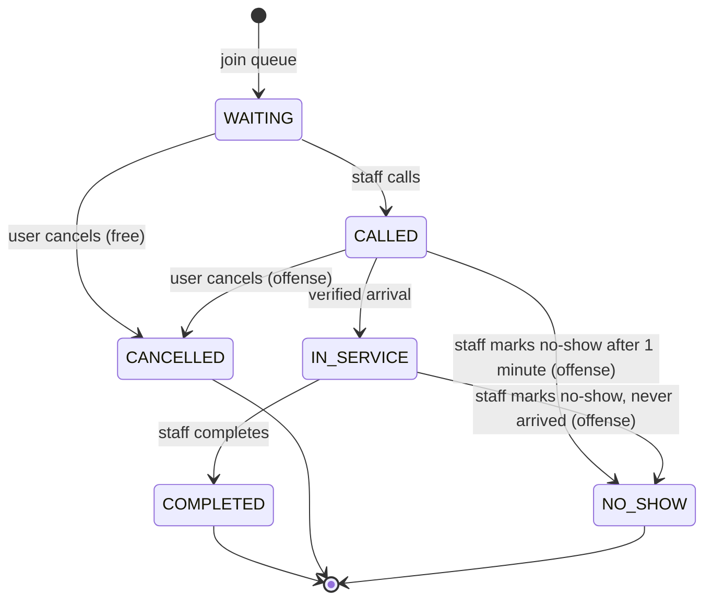
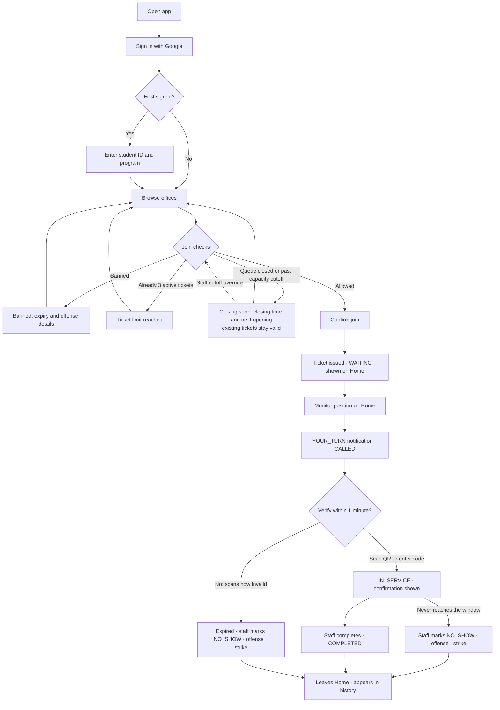
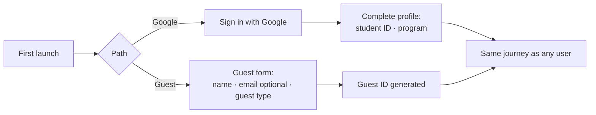
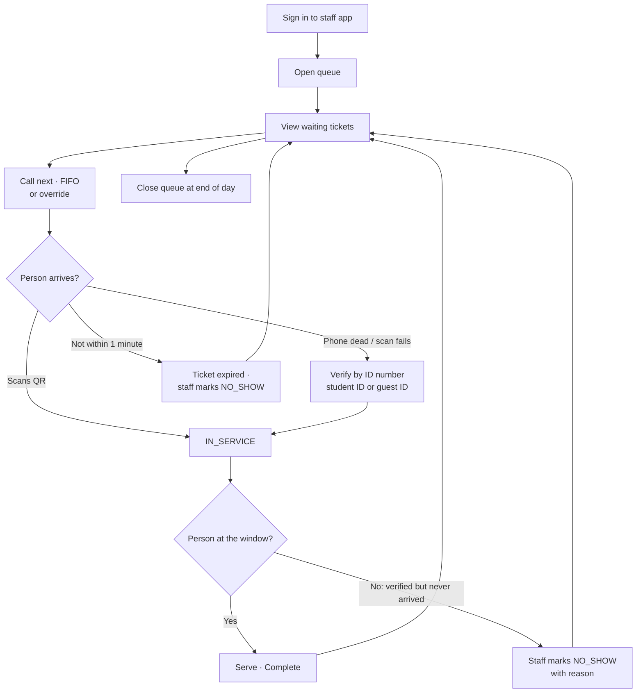

# QAMPUS — Product Requirements Document

**Version:** 1.3 · **Scope:** Version 1 · **Status:** Authoritative for product behavior.

Companion documents: `QAMPUS_TDD.md` (architecture, data model, implementation) and `QAMPUS_UIUX.md` (screens, components, visual system, surface-level journeys). Rule IDs run in one sequence across the PRD and TDD; this document owns `R-01` to `R-31`. Rules added after v1.0 use suffix IDs (`R-08a`, `R-08b`) so existing IDs and cross-references stay stable.

**Revision notes (v1.2 → v1.3).**

- Backend decided: full Firebase (Firebase Auth, Firestore, Cloud Functions) on the Blaze plan within the free quota. No Express server. TDD v2.0 (Express/Postgres) is superseded in full and is to be rewritten; product rules here do not depend on it.
- Staff may mark an `IN_SERVICE` ticket `NO_SHOW` when the verified person never reached the window (R-23a). Chosen over a separate `ARRIVED` state or rotating QR.
- Rotating QR moved from Future to rejected: the office QR is static and encodes only the office code (R-20).
- Guests are a device-bound anonymous account (R-02); guest types cut to three; guest ID is `G` + six digits with no dash.
- New user notification: offense revoked (R-15, R-24).

**Revision notes (v1.1 → v1.2).**

- The backend is undecided (Firebase/NoSQL is under consideration). TDD sections tied to Express/Postgres — including the lazy no-show sweep (R-34, R-45) — are superseded pending that decision; product rules here are unaffected.
- No-shows are marked manually by staff after the grace period (R-12).
- Being called at two offices at once is deferred to V2 (R-09).
- Surface-level journeys (Home, Queue and Join, Scan, History, Notifications, Profile, Bans and Warnings) live in `QAMPUS_UIUX.md`, which is to be reconciled with this version.

**How to read this.** §1–§6 build the picture from nothing. §7 shows the system in motion. §8–§9 are the normative requirements. §10 is what "finished" means.

---

## Contents

1. Problem & Context
2. Product Overview
3. Goals & Success Indicators
4. Personas
5. Scope
6. Core Concepts
7. User Journeys
8. Functional Requirements
9. Non-Functional Requirements
10. Definition of Done
11. Known Limitations
12. Open Questions
13. Glossary

---

## 1. Problem & Context

Campus service offices — registrar, cashier, admissions, guidance — serve students one at a time at a single window. A student who needs a document joins a physical line and stays in it, because leaving means losing their place. There is no way to know how long the wait is or how close they are to the front without standing there.

The costs: students lose hours they could spend in class or studying, corridors outside offices congest, and staff work under the pressure of a visible crowd. During enrollment periods this compounds.

Offices already run an orderly process. The problem is not that the queue is badly managed — it is that holding a place in it requires physical presence.

---

## 2. Product Overview

QAMPUS is a mobile queuing system for campus service offices. A user joins a queue from their phone, receives a virtual ticket, watches the queue advance in real time, and walks to the office when their ticket is called. Arrival is confirmed by scanning a QR code posted at the office.

> **Value proposition:** Digitize the existing campus queue without changing how campus offices already operate.

The system deliberately mirrors the physical queue: first come first served, staff decide when to call the next person, and the queue closes when the office can no longer serve anyone before closing time. What it removes is the requirement to stand in the line while holding your place.

---

## 3. Goals & Success Indicators


| Goal                       | Indicator                                                              |
| -------------------------- | ---------------------------------------------------------------------- |
| Reduce unnecessary waiting | Students spend the wait elsewhere instead of at the office             |
| Reduce congestion          | Fewer people physically present at an office than tickets in its queue |
| Give users visibility      | A user can state their position and rough wait without asking staff    |
| Give staff a simple tool   | Staff operate the queue with no more effort than calling out a number  |
| Preserve office workflow   | Offices adopt without changing how they serve people                   |

Indicators are qualitative by design. V1 collects no analytics beyond what the capacity guardrail requires.

---

## 4. Personas

**Student** — the primary user. Has an institutional Google account, a phone, and classes that conflict with office hours. Wants to know when to walk over. On first sign-in supplies a student ID and program.

**Guest** — a parent, relative, representative, or alumnus transacting on a student's behalf. Has no institutional account. Uses the same app, identifies themselves in a short form, receives a system-generated guest ID, and is otherwise treated identically.

**Staff** — operates one office's queue from a computer at the service window. Needs to call the next person, mark absentees as no-shows, and mark people served with minimal clicks, while also serving walk-ins, verifying people by ID number when the QR path fails, and answering questions.

**Super administrator** — sets up offices, hours, and staff assignments. In V1 this role has no interface; setup is performed directly against the database.

---

## 5. Scope

### In scope

* Campus service offices, one queue each
* Remote joining from a mobile app
* Google OAuth for students, followed by a one-time student ID and program entry
* Device-bound anonymous identity with a self-declared profile and a generated guest ID for guests
* Static per-office QR arrival verification with a manual-code fallback for users and a staff ID-number fallback for students and guests
* Staff-controlled FIFO with authorized override
* Staff-marked no-shows, including reversal of a verified arrival the person never followed through
* A flat two-strike temporary ban for abandoned calls
* In-app notifications for all events, push for "your turn"
* A staff web application with an attached public "Now Serving" display in another tab/window
* Closing-time capacity guardrail
* Append-only logging of ticket transitions and privileged actions.
* Biometric Login and Theme Switching

### Out of scope

* Appointment scheduling and time slots
* Multiple queues or windows per office (Deferred in Version 1 Design)
* Multi-campus
* Rotating or time-limited QR codes (rejected, not deferred)
* A separate `ARRIVED` state between verification and service
* Non-school queues
* Automatic queue advancement or optimization
* Automatic no-show expiry
* Email/password login
* SMS/OTP of any kind
* Offline terminal operation
* A super-admin interface
* Scheduled reminder notifications
* Analytics beyond the capacity formula
* Data retention policy.

### Future

Deferred, not rejected:

* offline terminal operation
* Multiple service queues and windows
* Appointment scheduling
* Multi-campus and institutional integrations
* A super-admin interface
* Handling a user called at two offices at once.

---

## 6. Core Concepts

**Office** — a campus service unit with a short code (e.g. `R` for Registrar), a location, and operating hours. Each office runs exactly one queue.

**Queue** — the line for one office. It is `OPEN` or `CLOSED`, and it knows which ticket is currently being served.

**Ticket** — one person's place in one queue for one day. Its full number is `CODE-MM-DD-SEQ` (e.g. `R-09-12-005` is the fifth ticket the Registrar issued on September 12), and it moves through a fixed sequence of states. Client-facing surfaces show the short form `CODE-SEQ` (`R-005`) per R-08a.

**Call** — the act of a staff member calling the holder of a ticket. Nothing in the system calls a ticket automatically.

**Grace period** — one minute from the call, within which the user must arrive and verify. It is a countdown, not a negotiation: when it lapses the ticket is expired, scans no longer work, and staff mark it a no-show.

**Offense** — a permanent record that a user abandoned a called ticket, either by cancelling it or by being marked a no-show — after the grace period, or after a verification they never followed through. Offenses are a running count that caps by 2 only then resets.

**Ban** — a 24-hour block on joining new queues when users accumulate 2 offenses. Nothing else is restricted.

**Capacity guardrail** — an arithmetic check, run before every join, that the office can plausibly serve one more person before it closes.

**Verification** — proving physical arrival, normally by scanning the office's static QR code (which encodes only the office code) with the app. Fallbacks are manual code entry by the user and ID-number verification by staff. Staff remain the final check: a verification can be reversed to a no-show (R-23a).

**Institutional ID** — the identifier staff use to look up a person: the student ID for students, the generated guest ID for guests.

---

## 7. User Journeys

Surface-level journeys (Home, Queue and Join, Scan, History, Notifications, Profile, Bans and Warnings) are specified in `QAMPUS_UIUX.md`. The diagrams below cover the end-to-end behavior.

### 7.1 Ticket lifecycle



`COMPLETED`, `CANCELLED`, and `NO_SHOW` are terminal. A ticket in `WAITING`, `CALLED`, or `IN_SERVICE` is active, counts toward the three-ticket limit, and is shown on the user's Home. A ticket that reaches a terminal state leaves Home and appears in history (R-08b).

A `CALLED` ticket whose grace period has lapsed is expired but remains `CALLED` until staff mark it `NO_SHOW`.

An `IN_SERVICE` ticket whose holder verified but never reached the window can be marked `NO_SHOW` by staff (R-23a).

### 7.2 Student journey



Governed by R-01, R-04, R-07, R-08, R-08a, R-08b, R-12, R-13, R-14, R-17, R-19, R-20, R-23a, R-25.

### 7.3 Onboarding



No code, no password, no verification of what the user enters. Governed by R-01, R-02.

### 7.4 Staff loop



Staff trigger each step: calling, marking a no-show, and calling the next ticket are separate actions. Governed by R-04, R-05, R-06, R-11, R-12, R-20, R-22, R-23a, R-27.

### 7.5 Exception paths


| Situation                                              | What happens                                                                                                   | Rule       |
| ------------------------------------------------------ | -------------------------------------------------------------------------------------------------------------- | ---------- |
| Cancel while`WAITING`                                  | Confirmed by the user; free. No record beyond the log.                                                         | R-10       |
| Cancel while`CALLED`                                   | Confirmation states it counts as an offense; offense + strike. This includes an expired ticket not yet marked. | R-11       |
| Grace period lapses                                    | Ticket is expired; scans are invalid; staff mark`NO_SHOW`; offense + strike.                                   | R-12       |
| Scan after the grace period                            | Rejected with an "expired" message; nothing changes; logged only.                                              | R-12, R-23 |
| Verified but never reaches the window                  | Staff mark the`IN_SERVICE` ticket `NO_SHOW` with a reason; offense + strike.                                   | R-23a      |
| Second offense                                         | 24-hour ban; strike count resets.                                                                              | R-13       |
| Join attempt while banned                              | Rejected with the expiry time and the offenses behind it.                                                      | R-14       |
| Fourth active ticket                                   | Rejected, naming the three-ticket limit.                                                                       | R-07       |
| Office cancels the queue                               | Tickets cancelled, users notified, nobody penalized.                                                           | R-16       |
| Office closed or too close to closing                  | Joining disabled with an explanation; staff may override the cutoff.                                           | R-17, R-19 |
| Invalid scan (wrong office, no called ticket, expired) | Plain-language message; nothing changes; logged only.                                                          | R-23       |
| Camera unavailable or permission denied                | User falls back to manual code entry.                                                                          | R-21, R-31 |

---

## 8. Functional Requirements

### 8.1 Authentication & Identity

**R-01 — Google OAuth is the sole institutional sign-in**

- Students sign in through Google on the institution's domain; no passwords, no resets.
- First sign-in: enter a 7-digit student ID and a program (searchable list). Only program is editable in Profile. Any changes to the student ID can only be overridden by the Super Admin
- *Why: one identity system to build; staff need the ID to verify people when the QR path fails.*

**R-02 — A guest is a device-bound anonymous account, a self-declared profile, and a generated guest ID**

- An anonymous account is created on first use and bound to the device; it backs a real user record tagged as a guest.
- Before joining: `name` (required), `email` (optional), `guest_type` (required: parent or guardian, alumni, representative). Editable afterward.
- The system generates a unique guest ID (`G` + six digits, no dash, e.g. `G104728`), shown in the profile the same way as a student ID.
- *Why: staff need to know who they serve and need a lookup key; verifying guests would need an SMS gateway V1 cannot justify.*

**R-03 — One account is one person**

- Accounts are not shared or transferred.
- *Why: penalties and ticket limits mean nothing against a shared identity.*

### 8.2 Queue

**R-04 — FIFO is the default ordering**

- The earliest eligible `WAITING` ticket is the default candidate.
- *Why: it is what the physical queue already does.*

**R-05 — Advancement is staff-controlled**

- The system never calls a ticket, expires one, or advances the queue on its own.
- Staff trigger every call, every no-show, and every next call.
- *Why: only the person at the window knows when they are free.*

**R-06 — Staff may override the FIFO candidate**

- An authorized staff member may call a specific eligible ticket instead.
- The rest of the queue is not reordered; the override is logged.
- *Why: real offices accommodate priority cases; hiding that pushes staff off-system.*

**R-07 — A user may hold at most three active tickets**

- Counted across all offices. A fourth join is rejected, naming the limit.
- *Why: allows batching errands while preventing queue-hoarding.*

**R-08 — Ticket states and transitions are fixed**

- `WAITING → CALLED → IN_SERVICE → COMPLETED`.
- `WAITING`/`CALLED → CANCELLED`; `CALLED`/`IN_SERVICE → NO_SHOW` (marked by staff; from `IN_SERVICE` only per R-23a).
- Verified arrival goes straight to `IN_SERVICE`.
- *Why: in a single-window office, marking someone arrived is starting their service.*

**R-08a — Ticket holders see the short ticket number**

- Stored number stays `CODE-MM-DD-SEQ`.
- Home, notifications, modals, and the staff live queue show `CODE-SEQ`.
- History and the staff activity log show the full number.
- *Why: the date adds nothing to a same-day ticket, while the full form keeps records traceable.*

**R-08b — Active tickets live on Home; finished tickets live in history**

- `WAITING`, `CALLED`, and `IN_SERVICE` tickets appear on Home with their current state; a called ticket shows its grace-period countdown.
- `COMPLETED`, `CANCELLED`, and `NO_SHOW` tickets leave Home and appear in history.
- *Why: Home answers "where am I right now"; history answers "what happened".*

**R-09 — Deferred to V2: user called at more than one office at once**

- V1 does not block it: each office's QR resolves only against that office's ticket, and each grace period runs from its own call time.
- How the app presents simultaneous calls (stacked prompts, competing countdowns) is unspecified for V1.
- *Why: an edge case not worth resolving before the core flows work.*

### 8.3 Offenses & Bans

**R-10 — Cancelling while `WAITING` is free**

- No offense, no strike. The user confirms first.
- *Why: leaving a physical line before being served costs nothing.*

**R-11 — Abandoning a called ticket is an offense, however it happens**

- Cancelling a called ticket, being marked a no-show after the grace period, and being marked a no-show after a verification the user never followed through (R-23a) each record an offense and a strike. There is no lighter tier.
- Cancelling an expired ticket that staff have not yet marked is still a cancellation of a called ticket.
- Before cancelling a called ticket, the user is told it counts as an offense and confirms.
- *Why: from the office's side both produce the same wasted call.*

**R-12 — The grace period is one minute and triggers a manual no-show**

- The countdown starts at the call and is shown to the user.
- At zero the ticket is expired: scans and manual codes are rejected as expired. It stays `CALLED` until staff act.
- Staff mark it `NO_SHOW`: the offense and strike are recorded and the user is notified. Staff then call the next ticket as a separate action.
- *Why: a called-but-absent ticket blocks the window, and staff decide when the queue moves.*

**R-13 — Two offenses produce a flat 24-hour ban**

- The second offense sets the ban and resets the strike count. No escalation.
- *Why: deterrence without an escalation ladder nobody will tune.*

**R-14 — A ban blocks joining only**

- Banned users still sign in, browse, and read their history.
- A join attempt says the user is banned, when it ends, and which offenses caused it.
- *Why: the penalty targets the behavior, not access to information.*

**R-15 — Authorized staff can revoke offenses**

- Assigned staff may revoke offenses tied to their own office's tickets; a super administrator may revoke any.
- Revocation reverses the strike and lifts any ban it caused.
- The user is notified that the offense was revoked.
- *Why: the system will sometimes be wrong, and there must be a way to say so.*

**R-16 — Office- or system-initiated cancellation never penalizes**

- Affected tickets are cancelled and users notified with the reason. No offense, even if already called.
- *Why: users must never absorb the cost of an office's own disruption.*

### 8.4 Capacity

**R-17 — Joining is blocked when the office cannot plausibly serve one more person**

```text
(minutes until close) ÷ (average service minutes) ≥ (queue length) + 1
```

- When this fails, joining is disabled with an explanation covering the closing time and when the office next opens.
- A queue that is `CLOSED` blocks joining with the same kind of explanation.
- Already-issued tickets remain valid.
- *Why: a ticket that cannot be served before closing is worse than no ticket.*

**R-18 — Average service duration is measured, not configured**

- Taken from tickets completed today and yesterday at that office; falls back to a per-office default when there are none.
- The average may be kept as a running value updated when tickets complete, rather than recomputed on every join; the window and fallback are unchanged. Tickets reversed to `NO_SHOW` never contribute.
- *Why: offices differ; a static estimate would be wrong for most of them.*

**R-19 — Authorized staff may override the cutoff**

- Every override is logged.
- *Why: staff sometimes agree to stay late, and the system should not forbid it.*

### 8.5 Arrival Verification

**R-20 — Valid verification starts service**

- Each office has one static QR code that encodes only its office code; it carries no user, ticket, or time data.
- The system checks the user's identity, that the ticket belongs to the scanned office, that it is `CALLED`, and that the grace period has not lapsed. All checks and the transition run on the server; the client submits only the scanned office code.
- On success the ticket moves to `IN_SERVICE` and the user sees a confirmation.
- The scanner is reachable at any time from main navigation and is offered when the user is notified of a call.
- *Why: proving presence is the whole point of the QR.*

**R-21 — Scanning and manual code entry are the same operation**

- Identical validation, outcome, and failure behavior.
- Manual entry is also the path when the camera is unavailable or permission is denied.
- *Why: a broken camera should not change the rules that apply to you.*

**R-22 — ID number is a staff-mediated fallback**

- While a ticket is still `CALLED`, staff may verify the person by institutional ID (student ID or guest ID), producing the same transition.
- Exists only in the staff application; the user does nothing.
- *Why: dead phones and users who cannot scan still need to be served.*

**R-23 — Invalid verification attempts are logged and nothing more**

- No state change, counter, threshold, or penalty.
- The user sees a plain-language reason: wrong office, no called ticket, or expired.
- *Why: most invalid scans are honest mistakes; policing them costs more than it saves.*

**R-23a — Staff may reverse a verification to a no-show**

- While a ticket is `IN_SERVICE`, assigned staff may mark it `NO_SHOW` when the verified person never reached the window (for example, the static QR was scanned from a photo or from elsewhere).
- Staff confirm and give a reason. The action is logged with its actor (R-28).
- The outcome is identical to R-12: offense + strike, `NO_SHOW` notification, revocable under R-15. The ticket leaves Home and appears in history.
- Not available once a ticket is `COMPLETED`. Calling the next ticket remains a separate action.
- *Why: a static QR proves possession of the code, not presence. The person at the window is the only reliable check, and this closes the gap without an `ARRIVED` state or rotating QR.*

### 8.6 Notifications

**R-24 — Notification types**

- *User:* queue confirmed, your turn, approaching turn, no-show (sent when staff mark it), queue cancelled, service completed, warning, offense revoked, global announcement.
- *Staff:* queue approaching cutoff, global announcement.

**R-25 — Everything appears in-app; only "your turn" is pushed**

- All notifications persist in the app regardless of settings.
- Push is implemented for "your turn" alone and respects the user's push preference.
- *Why: it is the only notification that is useless if seen late.*

**R-26 — Penalty history is read from offense records**

- The Bans & Warnings view shows each offense: what happened, when, whether it caused a ban, whether it was revoked.
- It also shows any ban in effect, and after a first unresolved offense states that one more results in a ban.
- *Why: notifications are a mailbox; a mailbox is not a record.*

### 8.7 Staff Authorization

**R-27 — Authority matrix**


| Action                                         | Authority                                                      |
| ---------------------------------------------- | -------------------------------------------------------------- |
| Create/delete an office, edit its name or code | Super administrator                                            |
| Edit office location and operating hours       | Assigned staff, or super administrator                         |
| Open/close a queue                             | Assigned staff, or super administrator                         |
| Call, override, verify, mark no-show, complete | Assigned staff, or super administrator                         |
| Mark an`IN_SERVICE` ticket no-show (R-23a)     | Assigned staff, or super administrator                         |
| Office-level queue cancellation                | Assigned staff, or super administrator                         |
| Capacity-cutoff override                       | Assigned staff, or super administrator                         |
| Offense revocation                             | Assigned staff (own office only), or super administrator (any) |

Office codes appear inside every ticket number, which is why changing them is privileged.

**R-28 — Every privileged action is recorded with its actor**

- Overrides, no-show markings (reversals of verified arrivals always carry a reason), cancellations, closures, cutoff overrides, and revocations each produce a log entry naming who did it and, where relevant, why.
- *Why: accountability for actions that affect other people's place in line.*

---

## 9. Non-Functional Requirements

**R-29 — No retention or deletion policy in V1.** All records are kept indefinitely.

**R-30 — Security follows standard practice.** Encrypted transport, server-side session and authorization checks on every privileged action, no client-supplied identity, secrets in configuration. Clients never write authoritative state (ticket status, offenses, strikes, bans, sequence numbers) directly; every such change runs on the server.

**R-31 — Accessibility targets** are specified in the UI/UX document: adequate contrast, legible type, status conveyed by icon and label rather than color alone, large touch targets, plain-language errors, and a non-QR path to verification.

---

## 10. Definition of Done

V1 is complete when each of the following can be demonstrated end to end.


| #  | Demonstration                                                                                                                        | Rules            |
| -- | ------------------------------------------------------------------------------------------------------------------------------------ | ---------------- |
| 1  | A student signs in with Google, enters student ID and program on first sign-in, and reaches the queue list                           | R-01             |
| 2  | A guest completes the profile form, receives a guest ID shown in their profile, and joins with no credentials                        | R-02             |
| 3  | A join produces a uniquely numbered ticket stored as`CODE-MM-DD-SEQ`, shown as `CODE-SEQ` on Home and in full in history             | R-08, R-08a      |
| 4  | A fourth simultaneous join is rejected naming the limit                                                                              | R-07             |
| 5  | Staff call the next ticket in FIFO order from the staff app                                                                          | R-04, R-05       |
| 6  | Staff override FIFO for a specific ticket, and the override is logged                                                                | R-06, R-28       |
| 7  | The called user receives a push notification; other events appear in-app                                                             | R-24, R-25       |
| 8  | The public display shows Now Serving, the next three tickets, the office QR, and the manual code                                     | R-20, R-21       |
| 9  | A QR scan moves the ticket to`IN_SERVICE` and shows a confirmation; manual code does the same                                        | R-20, R-21       |
| 10 | Staff verify a student or a guest by ID number with the same result                                                                  | R-22             |
| 11 | An invalid scan changes nothing, shows a plain message, and is logged                                                                | R-23             |
| 12 | Cancelling a called ticket records an offense after a confirmation naming it; so does staff marking a no-show after the grace period | R-11, R-12       |
| 13 | A second offense bans the user for 24 hours; the next join attempt explains the ban and its expiry                                   | R-13, R-14       |
| 14 | Staff revoke an offense and the ban lifts                                                                                            | R-15             |
| 15 | Staff complete service; the ticket leaves Home and appears in the user's history                                                     | R-08b            |
| 16 | An office cancels its queue; users are notified and nobody is penalized                                                              | R-16             |
| 17 | Joining is blocked near closing or while the queue is closed, with an explanation, and staff can override the cutoff                 | R-17, R-18, R-19 |
| 18 | Privileged actions can be listed with their actors                                                                                   | R-28             |
| 19 | The staff app shows a plain unavailable state when the backend is unreachable                                                        | —               |
| 20 | Cancelling a`WAITING` ticket requires confirmation and is free                                                                       | R-10             |
| 21 | Home shows`WAITING`, `CALLED` (with countdown), and `IN_SERVICE` tickets with their current state                                    | R-08b            |
| 22 | A student edits their student ID and program in Profile                                                                              | R-01             |
| 23 | After one minute a scan or manual code is rejected as expired; the ticket stays called until staff mark it no-show                   | R-12, R-23       |
| 24 | Staff mark an`IN_SERVICE` ticket `NO_SHOW` with a reason; an offense is recorded, the user is notified, and the action is logged     | R-23a, R-28      |
| 25 | Revoking an offense notifies the user                                                                                                | R-15, R-24       |

---

## 11. Known Limitations

1. **Guests can evade bans** by clearing app data or reinstalling, which creates a fresh anonymous account and guest ID. Closing this needs verified identity, which V1 does not have.
2. **Guest profiles are unverified** and may be false. They inform staff; they do not authenticate in the app.
3. **Student IDs and programs are self-entered and unverified.** Staff ID verification confirms only that the person matches what the account states.
4. **No grace for legitimate lateness.** Someone crossing campus who misses the one-minute window takes the same offense as someone who never left. Two offenses is the whole budget.
5. **Expired tickets wait for staff.** Until staff mark a no-show, an expired ticket holds the window.
6. **Simultaneous calls at two offices** have no defined presentation in V1 (R-09).
7. **No analytics.** Service duration is measured for the capacity formula only.
8. **No super-admin interface.** Office and staff setup requires database access.
9. **A static QR can be scanned without being present** (e.g. a photo of the display). Only staff notice, and the remedy is manual (R-23a).

---

## 12. Open Questions


| Question                                              | Status                                                                                                                                                             |
| ----------------------------------------------------- | ------------------------------------------------------------------------------------------------------------------------------------------------------------------ |
| Backend and API specification                         | Decided: full Firebase (Auth, Firestore, Cloud Functions), no Express. TDD v2.0 superseded in full; rewrite pending, with the API specification as a section of it |
| Manual code format and its relation to the QR payload | Not defined; the QR encodes the office code only                                                                                                                   |
| Source of the program list                            | Not defined                                                                                                                                                        |
| UI placement of the cancel action                     | To be settled in the UI/UX document                                                                                                                                |
| Behavior when a user is called at two offices at once | Deferred to V2                                                                                                                                                     |
| `QAMPUS_UIUX.md`                                      | v1.1; to be reconciled with v1.3 (no-show control on in-service tickets, offense-revoked notification, guest types)                                                |

---

## 13. Glossary


| Term                    | Meaning                                                                                                                                               |
| ----------------------- | ----------------------------------------------------------------------------------------------------------------------------------------------------- |
| **Active ticket**       | A ticket in`WAITING`, `CALLED`, or `IN_SERVICE`; shown on Home                                                                                        |
| **Ban**                 | A 24-hour block on joining new queues                                                                                                                 |
| **Call**                | A staff member summoning a ticket holder                                                                                                              |
| **Capacity guardrail**  | The pre-join check that the office can still serve one more person today                                                                              |
| **Expired ticket**      | A`CALLED` ticket whose grace period has lapsed; scans are rejected until staff mark it a no-show                                                      |
| **Grace period**        | The one minute a called user has to arrive and verify                                                                                                 |
| **Guest**               | A non-student user identified by a device-bound anonymous account, a self-declared profile, and a generated guest ID                                  |
| **Guest ID**            | System-generated identifier (`G` plus six digits, no dash) shown in the guest profile; the guest equivalent of a student ID                           |
| **Institutional ID**    | The student ID or guest ID staff use to look a person up                                                                                              |
| **Office code**         | A short identifier (`R`) that appears in every ticket number                                                                                          |
| **Offense**             | A permanent record of an abandoned called ticket (cancelled after call, or marked no-show after the grace period or after an unfollowed verification) |
| **Program**             | The student's academic program, chosen from a searchable list at first sign-in                                                                        |
| **Public display**      | The unauthenticated "Now Serving" screen shown at the office                                                                                          |
| **Short ticket number** | `CODE-SEQ`, the client-facing form of the ticket number                                                                                               |
| **Strike**              | The count of a user's unresolved offenses; two means a ban                                                                                            |
| **Student ID**          | A 7-digit number entered by the student at first sign-in, editable in Profile                                                                         |
| **Terminal state**      | `COMPLETED`, `CANCELLED`, or `NO_SHOW` — a ticket at rest; shown in history                                                                          |
| **Ticket**              | One person's place in one queue on one day                                                                                                            |
| **Verification**        | Confirming physical arrival: QR scan, manual code, or staff ID-number entry; reversible by staff to a no-show (R-23a)                                 |

---

*End of QAMPUS Product Requirements Document*
