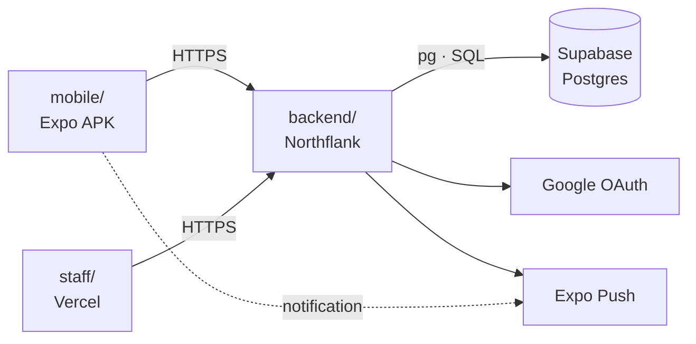
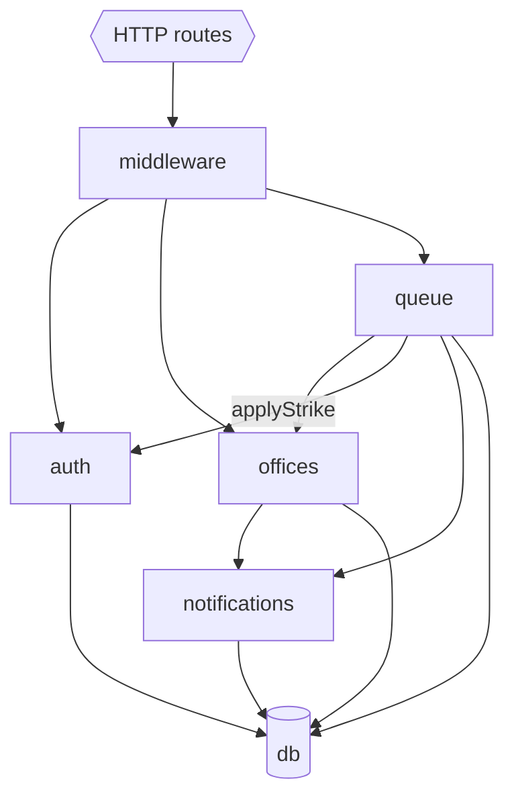
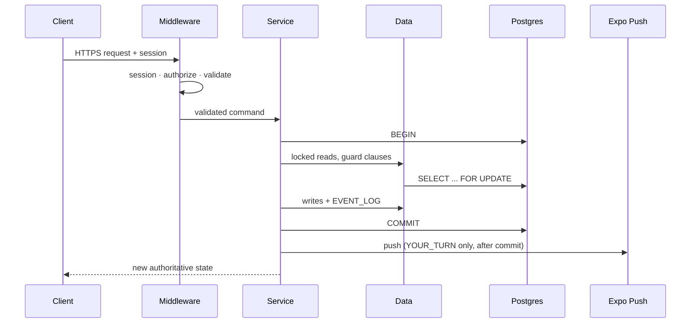
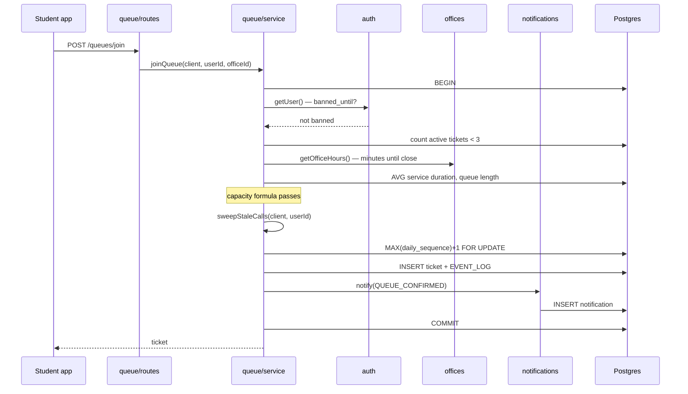
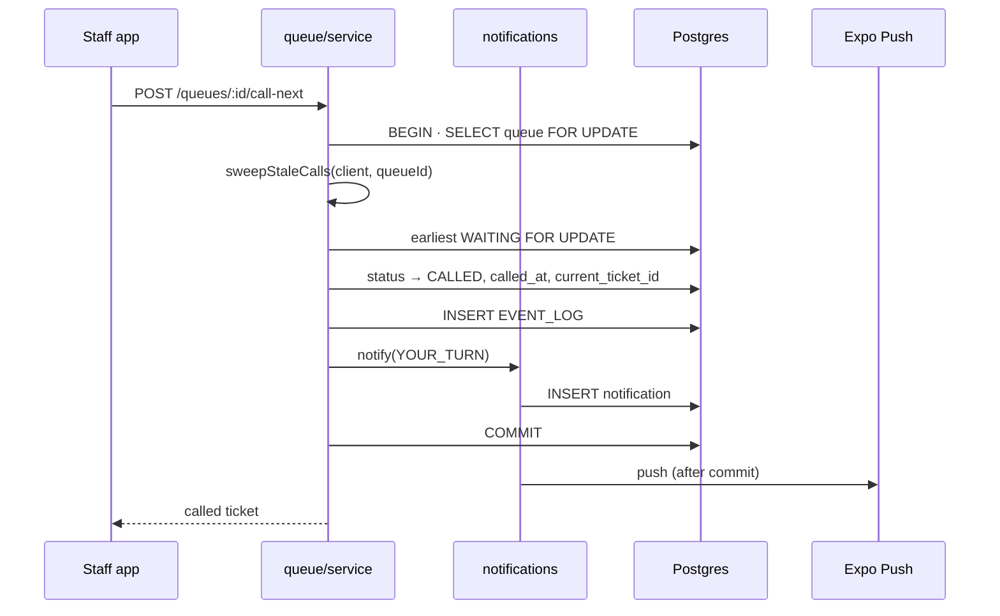
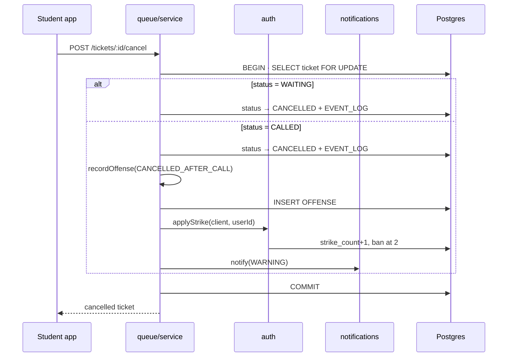
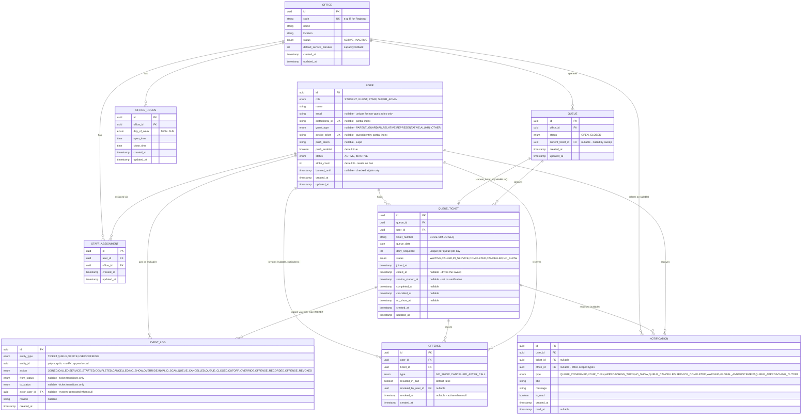

# QAMPUS — Technical Design Document
 
**Version:** 2.0 · **Scope:** Version 1 · **Status:** Authoritative for architecture, data model, and implementation.
 
Companion documents: `QAMPUS_PRD.md` (product behavior) and `QAMPUS_UIUX.md` (screens and visual system). Rule IDs continue the PRD's sequence; this document owns `R-32` to `R-56`.
 
**Reading order.** This document assumes the PRD. Terms used here — ticket, call, grace period, offense, strike, capacity guardrail — are defined in PRD §6 and §13 and are not redefined.
 
---
 
## Contents
 
1. Locked Stack
2. Deployment Topology
3. Repository Layout
4. Module Catalog
5. Layering Rules
6. Module Interaction
7. Request Lifecycle
8. Concurrency & Transactions
9. Write Paths
10. Sequence Diagrams
11. Shared Logic
12. Error Model
13. Data Model
14. Constraints
15. Migrations & Seed
16. Student App Structure
17. Staff App Structure
18. Client State Conventions
19. Environments & Configuration
20. API Specification
21. Rule Index
---
 
## 1. Locked Stack
 
**R-48 — The stack below is fixed for V1. Clients hold an API base URL and nothing else.**
 
| Layer | Choice | Runs on | Notes |
|---|---|---|---|
| Repository | GitHub, single monorepo | — | One repo, three deploy targets |
| Backend | Node + Express, JavaScript | Northflank | Always-on free tier, no cold start |
| DB access | `pg` driver, SQL strings | — | Chosen for native `FOR UPDATE`; see §8 |
| Database | PostgreSQL | Supabase | Managed; backend connects via pooler |
| Staff app | React DOM SPA, Vite | Vercel | Static build, no server |
| Student app | React Native, Expo | EAS build → APK | Distributed as a file, not hosted |
| Client state | Zustand | — | Session only; see §18 |
| Auth provider | Google OAuth | — | Domain restricted by env var |
| Push | Expo Push | — | `YOUR_TURN` only |
 
**Not in the stack, deliberately:** message broker, background worker, scheduler, WebSockets, ORM, realtime subscriptions, admin UI.
 
**The database credential exists in exactly one place** — the backend's environment. No client ever holds it, and no client opens a database connection.
 
---
 
## 2. Deployment Topology
 
**R-32 — The backend is the sole business authority.**
Clients render server state, collect input, and submit commands. They never decide eligibility, ordering, state transitions, capacity, offenses, authorization, or ticket ownership. Identity is resolved server-side on every request; a client-supplied identity is never trusted.
 

 
**R-33 — Clients poll.**
Clients request current state at a fixed interval over HTTP. No WebSockets, no Supabase Realtime.
*Rationale: polling has no connection lifecycle to manage, and the staff display polling continuously is also what drives the lazy no-show sweep (R-45).*
 
**R-34 — There is no background worker and no job table.**
No-show expiry happens inside the request that reads the queue (R-45). Ban expiry is a timestamp comparison at join time. Capacity averages are computed on demand. Push is sent inline from the call handler.
*Rationale: a worker is a second deployable with its own failure modes, added to serve three pieces of work that each fit inside an existing request.*
 
**R-35 — Two client applications, three surfaces.**
 
| Surface | Technology | Host | Auth |
|---|---|---|---|
| Student app | React Native / Expo | EAS build, installed | Google OAuth or device token |
| `/staff/*` | React DOM SPA | Vercel | Staff session |
| `/display/:officeCode` | Same SPA, separate route | Vercel | None |
 
The student app contains no staff branching. The two SPA routes typically run in two browser tabs on the same office machine.
 
**R-36 — During a backend outage the clients show a plain unavailable state.**
No local queue authority, no local persistence, no sync. The display shows "temporarily unavailable, please wait."
 
---
 
## 3. Repository Layout
 
**R-49 — One monorepo, one root directory per deploy target.**
 
```text
qampus/
├── backend/                 → Northflank (root: backend/)
│   ├── src/
│   │   ├── config/          env vars, validated at boot
│   │   ├── db/              pool.js · withTransaction.js
│   │   ├── middleware/      session.js · authorize.js · validate.js · errors.js
│   │   ├── auth/            routes.js · service.js · data.js
│   │   ├── offices/         routes.js · service.js · data.js
│   │   ├── queue/           routes.js · service.js · data.js
│   │   │                    capacity.js · sweep.js · offenses.js
│   │   ├── notifications/   service.js · data.js · push.js
│   │   └── app.js
│   └── package.json
│
├── staff/                   → Vercel (root: staff/)
│   └── src/
│       ├── routes/          staff/* · display/:officeCode
│       ├── components/
│       ├── services/api.js
│       ├── stores/session.js
│       └── main.jsx
│
├── mobile/                  → EAS build (root: mobile/)
│   └── src/
│       ├── screens/
│       ├── components/
│       ├── navigation/
│       ├── services/api.js
│       ├── stores/session.js
│       └── hooks/usePolling.js
│
├── database/                → applied manually to Supabase
│   ├── migrations/          001_init.sql, 002_...
│   └── seeds/               offices, hours, staff assignments
│
└── docs/                    PRD · TDD · UI/UX
```
 
Each client keeps its own `api.js` and `session.js` rather than sharing a package. They are roughly forty lines each; a shared workspace costs more setup than it saves.
 
---
 
## 4. Module Catalog
 
**R-37 — Four domain modules, one deployable.**
 
| Module | Owns tables | Depends on | Exposes to other modules |
|---|---|---|---|
| `auth` | USER | `db` | `applyStrike()`, `getUser()` |
| `offices` | OFFICE, OFFICE_HOURS, STAFF_ASSIGNMENT | `db`, `notifications` | `assertStaffFor()`, `getOfficeHours()` |
| `queue` | QUEUE, QUEUE_TICKET, OFFENSE, EVENT_LOG | `db`, `offices`, `notifications`, `auth` | — |
| `notifications` | NOTIFICATION | `db`, Expo Push | `notify()` |
 
`queue` carries most of the system. `notifications` stays a separate module despite being thin: it is the only writer to the notification table and the only caller of the push provider, and both `queue` and `offices` produce notifications, so folding it into either would make the other reach across a boundary.
 
**R-38 — The institutional domain is configuration, not code.**
The accepted OAuth domain (`hd` claim or email suffix) comes from an environment variable. A dev-only bypass login exists so that OAuth redirect configuration never blocks other work.
 
**R-39 — Super-administrator setup is a SQL seed.**
Offices, office hours, and staff assignments are inserted by a seed file. No administrative endpoints or UI in V1.
 
---
 
## 5. Layering Rules
 
**R-50 — Every module has three layers, in one direction.**
 
```text
routes.js    HTTP only — parse input, call service, shape response
service.js   business rules, transaction boundary, cross-module calls
data.js      SQL only — takes a client, returns rows
```
 
- Routes never contain SQL.
- Data never makes a decision — no branching on business rules, no calls to other modules.
- Services never touch `req` or `res`.
**R-51 — Module dependencies point one way.**
 
Permitted: `queue → offices`, `queue → auth`, `queue → notifications`, `offices → notifications`, and any module → `db`.
 
Forbidden: `notifications → queue`, `notifications → offices`, `offices → queue`, `auth →` any domain module. Each would create a cycle.
 
**R-52 — Every service function takes an open `client` as its first argument.**
The caller owns the transaction. This is what allows Join — five checks and three writes across three modules — to commit or roll back as one unit.
 
```js
export async function joinQueue(client, userId, officeId) { ... }
```
 
**R-53 — A module never writes another module's tables.**
Cross-module writes go through the owner's exposed function, passing the open client so both writes land in the same transaction. `recordOffense()` in `queue` must increment `strike_count` on USER, so it calls `auth.applyStrike(client, userId)` rather than issuing the UPDATE itself.
 
---
 
## 6. Module Interaction
 

 
Middleware resolves identity before any domain module is reached, and for office-scoped actions confirms an active staff assignment via `offices.assertStaffFor()`.
 
---
 
## 7. Request Lifecycle
 

 
Push is sent after commit, never inside the transaction — a failed push must not roll back a call.
 
---
 
## 8. Concurrency & Transactions
 
**R-40 — Conflicting operations use transactions with row-level locking.**
Any operation that can contend for the same rows — call next, override, cancel, sweep, and join sequence generation — runs inside a transaction taking `SELECT ... FOR UPDATE` on the affected ticket or queue rows.
 
This is the only mechanism that prevents:
 
- two staff clients calling the same waiting ticket
- a sweep and a user's cancel both recording an offense for one ticket
- two simultaneous joins claiming the same daily sequence number
All transactions go through one helper:
 
```js
export async function withTransaction(fn) {
  const client = await pool.connect();
  try {
    await client.query('BEGIN');
    const result = await fn(client);
    await client.query('COMMIT');
    return result;
  } catch (e) {
    await client.query('ROLLBACK');
    throw e;
  } finally {
    client.release();
  }
}
```
 
*Rationale for raw `pg`: `FOR UPDATE` is expressible directly. An ORM would force the system's most delicate logic into a raw-SQL escape hatch.*
 
---
 
## 9. Write Paths
 
Every state-mutating operation in V1. Everything else is a read.
 
| Path | Steps |
|---|---|
| **Guest profile** | Create or update `name`, `email`, `guest_type` on the device-token user |
| **Join queue** | Ban check → three-ticket check → capacity check → `sweepStaleCalls(user_id)` → sequence generation → insert → queue-confirmed notification |
| **Call next** | Row lock → `sweepStaleCalls(queue_id)` → FIFO select or override → `CALLED` → set `current_ticket_id` → your-turn notification and push |
| **Cancel** | `WAITING`: free status flip. `CALLED`: row lock → status flip → `recordOffense(CANCELLED_AFTER_CALL)` |
| **Verify arrival** | Validate identity, office, and state → `CALLED → IN_SERVICE` → set `service_started_at`. Same path for QR, manual code, and staff ID fallback. |
| **Complete service** | `IN_SERVICE → COMPLETED` → timestamp → completion notification |
| **Cancel / close queue** | Authorization check → affected tickets `CANCELLED` → notify with reason → log |
| **Revoke offense** | Set `revoked_at` and `revoked_by_user_id` → decrement `strike_count` → clear `banned_until` if `resulted_in_ban` |
| **Mark notification read** | Set `is_read`, `read_at` |
 
No state-machine framework is warranted. Each handler is a transaction with a few guard clauses. Only Join stacks multiple checks, and they are sequential and independent, so it reads as a checklist rather than branching logic.
 
---
 
## 10. Sequence Diagrams
 
### 10.1 Join queue — the most complex path
 

 
Any failed guard throws, rolls back, and returns an error naming the reason (§12).
 
### 10.2 Call next — the contended path
 

 
A second staff client issuing the same request blocks on the queue lock, then finds the ticket already `CALLED` and selects the next one.
 
### 10.3 Cancel — the cross-module write
 

 
`applyStrike` receives the same open client, so the offense row and the strike commit together or not at all.
 
---
 
## 11. Shared Logic
 
Two functions mutate state from more than one entry point. Both must exist in exactly one module.
 
**R-45 — `sweepStaleCalls(client, scope)` performs no-show expiry lazily.**
 
Called from exactly two handlers:
 
| Handler | Scope |
|---|---|
| Staff queue read | by `queue_id` |
| Student join attempt | by `user_id` |
 
The staff trigger is primary: the staff app polls continuously during operating hours, so a stale ticket resolves within one poll interval. The join trigger exists so that a student blocked by their own stale ticket unblocks themselves immediately rather than waiting for staff to open the queue screen.
 
For each `CALLED` ticket whose `called_at` is older than one minute, inside the same transaction and row lock as the calling operation:
 
1. Set `status = NO_SHOW`, `no_show_at = now()`
2. `recordOffense(client, userId, ticketId, NO_SHOW)`
3. If `QUEUE.current_ticket_id` references the swept ticket, set it to `NULL`
4. Write the ticket's `EVENT_LOG` row
**R-46 — `recordOffense(client, userId, ticketId, type)` is the single offense path.**
 
Called from exactly two places: the cancel handler and the sweep. It:
 
1. Inserts the `OFFENSE` row
2. Calls `auth.applyStrike(client, userId)`, which increments `strike_count` and, on reaching 2, sets `banned_until = now() + 24 hours` and resets the count to 0
3. Marks the offense `resulted_in_ban = true` when the strike caused a ban
4. Sends the warning notification with the remaining count
5. Writes an `EVENT_LOG` row with `action = OFFENSE_RECORDED`
Duplicating either function is how a double-strike or double-insert bug gets in. The transaction and row lock around both are what make concurrent callers safe.
 
**Implementation note.** Generate `daily_sequence` with `SELECT MAX(daily_sequence) + 1 ... FOR UPDATE` inside the join transaction rather than maintaining a counter column. The join already takes the lock, so this is free.
 
---
 
## 12. Error Model
 
**R-54 — One error envelope, one set of status conventions.**
 
```json
{ "error": { "code": "USER_BANNED", "message": "You cannot join until 3:40 PM." } }
```
 
`message` is user-facing and rendered directly by clients. `code` is for client branching; clients never parse `message`.
 
| Status | Meaning | Example codes |
|---|---|---|
| 400 | Malformed request | `VALIDATION_FAILED` |
| 401 | No valid session | `NOT_AUTHENTICATED` |
| 403 | Authenticated but not permitted | `NOT_ASSIGNED_TO_OFFICE` |
| 404 | No such entity | `TICKET_NOT_FOUND` |
| 409 | Business rule refuses | `USER_BANNED`, `TICKET_LIMIT_REACHED`, `CAPACITY_CUTOFF`, `INVALID_TRANSITION` |
| 500 | Unexpected | `INTERNAL_ERROR` |
 
409 carries every rule rejection: the request was well-formed and permitted, but the system's state says no. Services throw a typed error; one error middleware converts it to this shape. No handler builds an error response itself.
 
---
 
## 13. Data Model
 
**R-41 — The diagram below is the authoritative schema.**
 
**R-42 — Ticket numbers are stored, formatted `CODE-MM-DD-SEQ`.**
Office code, operating month and day, per-queue daily sequence. The number is a display value; relational identity is always the primary key. Storing rather than deriving it is a deliberate choice, accepting that it can in principle drift from its inputs.
 
**R-43 — `EVENT_LOG.entity_id` is polymorphic and carries no foreign key.**
Integrity for that one column is enforced in application code. This is the cost of collapsing ticket events and audit records into one table, and it is the same property a separate audit table would have had.
 

 
Nine tables. Ban enforcement lives entirely on `USER`; `OFFENSE` is the penalty record and the only source for the Bans & Warnings screen.
 
---
 
## 14. Constraints
 
**R-44 — Required database constraints.**
 
| Constraint | Detail |
|---|---|
| Partial unique | `USER.email WHERE email IS NOT NULL AND role <> 'GUEST'` — guests self-declare and are excluded |
| Partial unique | `USER.institutional_id`, `USER.device_token`, each `WHERE ... IS NOT NULL` |
| Check | `guest_type` non-null when `role = 'GUEST'`, null otherwise |
| Composite unique | `(queue_id, queue_date, daily_sequence)` |
| Unique | `OFFICE.code` |
| Check | `COMPLETED` requires `completed_at`; `CANCELLED` requires `cancelled_at`; `NO_SHOW` requires `no_show_at` |
| Ordering | `joined_at ≤ called_at ≤ service_started_at ≤ completed_at` where both values exist |
| Referential | `QUEUE.current_ticket_id`, when set, must reference a ticket in the same queue |
 
Office hours and staff assignments have no status column: deactivating one means deleting the row. Acceptable while both are seeded. If staff are ever given an operating-hours editor, restore a status column first to avoid destructive edits.
 
---
 
## 15. Migrations & Seed
 
**R-55 — Schema changes are numbered SQL files, applied before the deploy that needs them.**
 
```text
database/migrations/001_init.sql
database/migrations/002_add_guest_type.sql
database/seeds/001_offices.sql
```
 
- Files are append-only. An applied migration is never edited; a correction is a new file.
- Applied by hand through the Supabase SQL editor. No migration tool in V1.
- **Order matters:** run the migration, confirm it, then deploy the code that depends on it. Reversing this makes every request fail until the migration lands.
- Seeds create the offices, operating hours, staff users, and staff assignments that R-39 defers from the application. Seeds are idempotent — safe to re-run.
---
 
## 16. Student App Structure
 
```text
mobile/src/
├── screens/           one file per screen (see UI/UX spec)
├── components/        ticket card, office card, status badge
├── navigation/        bottom tabs + stack
├── services/api.js    the only file that knows the API URL
├── stores/session.js  Zustand — user, token
└── hooks/usePolling.js
```
 
The API wrapper:
 
```js
const BASE = process.env.EXPO_PUBLIC_API_URL;
 
export async function api(path, { method = 'GET', body, token } = {}) {
  const res = await fetch(`${BASE}${path}`, {
    method,
    headers: { 'Content-Type': 'application/json',
               ...(token && { Authorization: `Bearer ${token}` }) },
    ...(body && { body: JSON.stringify(body) }),
  });
  const data = await res.json();
  if (!res.ok) throw new Error(data.error.message);
  return data;
}
```
 
The `EXPO_PUBLIC_` prefix is required for Expo to inline the value into the bundle. A physical phone cannot reach `localhost` — use the machine's LAN IP in development, which is why this belongs in configuration from day one.
 
The polling hook:
 
```js
export function usePolling(path, interval = 5000) {
  const [data, setData] = useState(null);
  const token = useSession(s => s.token);
 
  useEffect(() => {
    let alive = true;
    const tick = async () => {
      try { const d = await api(path, { token }); if (alive) setData(d); }
      catch {}
    };
    tick();
    const id = setInterval(tick, interval);
    return () => { alive = false; clearInterval(id); };
  }, [path, interval]);
 
  return data;
}
```
 
---
 
## 17. Staff App Structure
 
```text
staff/src/
├── routes/
│   ├── staff/         queue management, authenticated
│   └── display/       :officeCode, public, no auth
├── components/
├── services/api.js    same shape as mobile, browser fetch
├── stores/session.js  Zustand — staff user, token
└── main.jsx
```
 
The two route groups share the app shell but not the layout: `/display/:officeCode` renders large type for distance reading and has no navigation, while `/staff/*` sits behind a session guard that redirects to sign-in.
 
Both call the same endpoints as the mobile app through an identical wrapper. The only differences are how errors surface (toast rather than alert) and the polling interval, which is shorter on the staff queue view because it also drives the sweep (R-45).
 
---
 
## 18. Client State Conventions
 
**R-56 — Zustand holds session state only. Server data stays in the screen that polls it.**
 
| State | Where |
|---|---|
| Signed-in user, token, role | Zustand store |
| Queue lists, tickets, notifications | `useState` in the polling screen |
| Form input | Local component state |
 
Polled data is re-fetched every few seconds. Putting it in a global store creates a second copy that can disagree with the server and with other screens — the failure mode the polling model exists to avoid. The store is not a mirror of the database.
 
---
 
## 19. Environments & Configuration
 
**R-47 — Three deployables, each with its own root directory and configuration.**
 
| Artifact | Host | Root directory | Build |
|---|---|---|---|
| Backend | Northflank | `backend/` | `npm install` · `node src/app.js` |
| Staff SPA | Vercel | `staff/` | `npm run build` → static |
| Student app | EAS | `mobile/` | `eas build -p android` |
 
| Variable | Used by | Notes |
|---|---|---|
| `DATABASE_URL` | backend | Supabase pooler connection string |
| `SESSION_SECRET` | backend | |
| `GOOGLE_CLIENT_ID` / `SECRET` | backend | |
| `ALLOWED_EMAIL_DOMAIN` | backend | R-38 |
| `EXPO_PUSH_TOKEN` | backend | |
| `STAFF_ORIGIN` | backend | CORS allowlist for the Vercel domain |
| `DEV_BYPASS_ENABLED` | backend | Never true in production |
| `EXPO_PUBLIC_API_URL` | mobile | LAN IP in development |
| `VITE_API_URL` | staff | |
 
Configuration is read once at boot through `config/`, which fails fast if a required variable is missing. No module reads `process.env` directly.
 
**First build step, before any feature:** deploy a hello-world path end to end — Expo app → Northflank → Supabase, plus the staff SPA on Vercel. Deployment surprises are the most common cause of project failure near a deadline; hit them in week one while there is still time to route around them.
 
---
 
## 20. API Specification
 
Not yet written. It follows this document and the PRD, and when written becomes §20 of this document rather than a separate file.
 
Each endpoint will specify: method and path, authentication and authorization requirements, request shape, validation rules, success response, error codes drawn from §12, state transitions, transaction boundary, and logging.
 
---
 
## 21. Rule Index
 
| ID | Rule |
|---|---|
| R-32 | Backend is the sole business authority |
| R-33 | Clients poll |
| R-34 | No background worker or job table |
| R-35 | Two client applications, three surfaces |
| R-36 | Outage shows a plain unavailable state |
| R-37 | Four domain modules, one deployable |
| R-38 | Institutional domain is configuration; dev bypass exists |
| R-39 | Super-admin setup is a SQL seed |
| R-40 | Transactions with row-level locking |
| R-41 | The ERD is the authoritative schema |
| R-42 | Ticket numbers stored as `CODE-MM-DD-SEQ` |
| R-43 | `EVENT_LOG.entity_id` is polymorphic, app-enforced |
| R-44 | Required database constraints |
| R-45 | `sweepStaleCalls()` — lazy no-show expiry, two triggers |
| R-46 | `recordOffense()` — the single offense path |
| R-47 | Three deployables, root directories, configuration |
| R-48 | Locked stack; clients hold only an API URL |
| R-49 | One monorepo, one root directory per deploy target |
| R-50 | Three-layer modules: routes → service → data |
| R-51 | Module dependencies point one way; forbidden edges |
| R-52 | Service functions take an open `client` first |
| R-53 | A module never writes another module's tables |
| R-54 | One error envelope; status code conventions |
| R-55 | Numbered SQL migrations, applied before deploy |
| R-56 | Zustand holds session only |
 
PRD rules `R-01` to `R-31` are indexed in `QAMPUS_PRD.md` §8–§9.
 
---
 
*End of QAMPUS Technical Design Document*