# QAMPUS — UI/UX Specification

**Version:** 1.1 · **Scope:** Version 1 · **Status:** Authoritative for screens, components, visual system, and surface-level journeys.

Companion documents: `QAMPUS_PRD.md` v1.2 (product behavior) and `QAMPUS_TDD.md` v2.0 (architecture). Rule IDs (`R-xx`) refer to the PRD/TDD sequence. Where this document and the PRD disagree, the PRD wins and this document is wrong.

**Source visuals:** DOMinions Figma prototype (mobile). The Figma file supplies visual language, layout, and component styling only. Anything in it that conflicts with the PRD is listed in §14 and excluded.

**What changed from v1.0.**
- Guest OTP verification removed; replaced by a Guest Profile Form and a generated Guest ID (R-02).
- Complete Profile screen added (student ID + program) after first Google sign-in (R-01).
- `ARRIVED` renamed `IN_SERVICE` (R-08). Expired-but-unmarked called tickets get their own display state (R-12).
- Ticket number display rules added (R-08a). Cancel moves into a **Ticket modal** opened from the Home card.
- New and reworked modals: Called, In Service, Banned, Capacity Cutoff, Cancel Waiting, Cancel Called.
- Biometric and theme toggles restored as inert, navigable toggles (PRD §5).
- The "physical terminal" paragraph is replaced by full staff web and public display specifications.
- Per-surface journey diagrams added for student and staff (Mermaid).

---

## Contents

1. UX Principles
2. Information Architecture
3. Design System
4. Student Screen Specifications
5. Student Journeys
6. Staff Screen Specifications
7. Staff Journeys
8. Public Display Specification
9. Modal & Interaction Patterns
10. States & Edge Cases
11. Accessibility
12. Copy Guidelines
13. Requirement Coverage & Design Rationale
14. Reconciliation Log
15. Assumptions to Confirm

---

## 1. UX Principles

### 1.1 Guiding principle

> **The app should feel simpler than standing in line.**

For staff: **the tool should cost no more effort than calling out a number.**

### 1.2 Student priorities

- Immediate comprehension of queue status.
- Minimal steps to join.
- Clear presentation of active tickets, with the current state always visible.
- Unmistakable "Your Turn" feedback and a visible countdown.
- Clear success and failure feedback on scan.
- A non-QR path to verification.
- Clear explanations when a ban or closing-time capacity blocks a join.
- No copy or visual treatment that punishes users for legitimate office or system failures (R-16).

### 1.3 Staff priorities

- One primary action visible at all times (Call Next, or the next step for the current ticket).
- Destructive or consequential actions (no-show, cancel queue, override, revoke) require confirmation.
- No accidental no-shows: the button is disabled until the grace period lapses.
- Live queue readable at a glance from a desk, in a second browser tab beside other work.
- A plain, styled outage state rather than a broken screen (R-36).

---

## 2. Information Architecture

### 2.1 Student app (React Native / Expo)

**Navigation**
- Bottom bar, three buttons: **Home | Scan | Queue**. Scan is the center button, visually emphasized.
- Header icons on every primary screen: **avatar** (→ Profile) and **bell** (→ Notifications, with unread badge).
- Profile and Notifications are deliberately header-level so the three most frequent actions stay in the thumb-reachable bar.

**Screen inventory**

| ID | Screen | Notes |
|---|---|---|
| S01–S03 | Onboarding (3 slides) | Skippable |
| S04 | Login | "Continue with Google", "Continue as Guest" |
| S05 | Complete Profile | First Google sign-in only: student ID + program |
| S06 | Guest Profile Form | Name, email (optional), guest type; ends with generated Guest ID |
| S07 | Home — populated | Active tickets (`WAITING`, `CALLED`, `IN_SERVICE`) |
| S08 | Home — empty | No active tickets |
| S09 | Queue — Join view | Segmented switcher, searchable office list |
| S10 | Queue — History view | Terminal tickets, full ticket numbers |
| S11 | Scan | Camera + manual code entry |
| S12 | Notifications | Recent / Previous |
| S13 | Profile | Identity header, menu |
| S14 | Edit Profile | Student ID, program (students); name, email, guest type (guests) |
| S15 | Bans & Warnings | Read-only offense history |
| S16 | Settings | Push toggle and Light/Dark theme selector (functional); biometric toggle (inert) |
| S17 | Help & Support | FAQ and contact |

**Modals** (all centered; no bottom sheets anywhere)

| ID | Modal | Trigger |
|---|---|---|
| M01 | Join Confirmation | Join tapped on an eligible office |
| M02 | **Ticket** | Tapping a Home ticket card; holds Cancel |
| M03 | Cancel Waiting | Cancel in M02 while `WAITING` |
| M04 | Cancel Called | Cancel in M02 while `CALLED` (including expired) |
| M05 | **Called** | Staff calls the user's ticket (in-app, and on push tap) |
| M06 | **In Service** | Verified arrival |
| M07 | **Banned** | Join attempt while banned |
| M08 | **Capacity Cutoff** | Join attempt when the office cannot serve one more person, or the queue is closed |
| M09 | Log Out | Log Out in Profile |

Inventory: 17 screens and 9 modals. The separate "View my Ticket" screen is dropped; its only remaining function, Cancel, lives in M02.

### 2.2 Staff web application (React DOM + Vite)

**Routes**

| Route | Surface | Auth |
|---|---|---|
| `/staff/sign-in` | Staff sign-in | None |
| `/staff/queue` | Queue (main screen) | Staff session + office assignment |
| `/staff/offenses` | Offenses & revocation | Staff session + office assignment |
| `/staff/log` | Activity log | Staff session + office assignment |
| `/display/:officeCode` | Public display | None |

**Navigation.** Top bar: QAMPUS mark, office name, queue status pill (OPEN / CLOSED), tabs **Queue | Offenses | Activity Log**, bell (staff notifications), account menu (sign out). No sidebar; there are only three destinations.

**Screen inventory**

| ID | Screen | Notes |
|---|---|---|
| W01 | Sign-in | Institutional Google sign-in |
| W02 | Not Assigned | Signed in but no office assignment |
| W03 | Queue | Live queue, current ticket, all call actions |
| W04 | Offenses | Search by ID, revoke |
| W05 | Activity Log | Full ticket numbers, actors, reasons |
| D01 | Public Display | Now Serving, next 3, QR, manual code |
| — | Outage state | Shared by W03–W05 and D01 |

**Staff modals** (centered, same pattern as mobile)

| ID | Modal | Trigger |
|---|---|---|
| WM01 | Override Confirm | Override on a waiting row |
| WM02 | Verify by ID | Verify by ID on the current called ticket |
| WM03 | Mark No-Show Confirm | Mark No-Show (enabled state) |
| WM04 | Complete Service Confirm | Complete Service |
| WM05 | Close Queue Confirm | Close Queue |
| WM06 | Cancel Queue | Cancel Queue; requires a reason |
| WM07 | Cutoff Override Confirm | Override cutoff |
| WM08 | Revoke Offense Confirm | Revoke on an offense row |

---

## 3. Design System

### 3.1 Color tokens

| Token | Hex | Usage |
|---|---|---|
| Ink | `#0A0A0A` | Primary text, dark surfaces |
| Gold | `#FFC72C` | Primary accent, CTAs, called state |
| Deep Gold | `#C9982A` | Pressed and active states, secondary accent |
| Paper | `#FAF7F0` | Light background surface |
| Slate | `#6E6B63` | Secondary text, muted labels, terminal states |

**Proposed status tokens** (new; not in the Figma file, confirm before build — see §15):

| Token | Hex | Usage |
|---|---|---|
| Success | `#2E7D4F` | In service, completed |
| Danger | `#B3261E` | Expired, no-show, destructive actions |

Status tokens are never the only carrier of meaning (§11).

### 3.2 Typography

Clear, legible sans-serif. Headings in Ink on Paper for maximum contrast; secondary information in Slate.

| Surface | Scale |
|---|---|
| Mobile | Body 16, ticket number 32+ bold |
| Staff web | Body 14–16, data tables 14, current-ticket number 48+ |
| Public display | Now Serving number 160+, next-three 64+, everything readable from ~5 m |

### 3.3 Ticket number display rules (R-08a)

Stored as `CODE-MM-DD-SEQ`. Shown as follows:

| Surface | Form | Example |
|---|---|---|
| Home cards, Ticket modal, all modals | `CODE-SEQ` | `R-005` |
| Notifications | `CODE-SEQ` | `R-005` |
| Staff live queue, current ticket, public display | `CODE-SEQ` | `R-005` |
| Queue → History | Full | `R-09-12-005` |
| Staff activity log, offenses view | Full | `R-09-12-005` |

### 3.4 Ticket state display map

State is always conveyed by **icon + label**, with color as reinforcement.

| Displayed state | Underlying status | Icon | Label | Treatment |
|---|---|---|---|---|
| Waiting | `WAITING` | clock | Waiting | Slate outline |
| Called | `CALLED` (within grace) | bell | Your turn | Gold fill, countdown shown |
| Expired | `CALLED` (grace lapsed) | hourglass-alert | Expired | Danger outline, "Waiting for staff" |
| In service | `IN_SERVICE` | person-check | In service | Success fill |
| Completed | `COMPLETED` | check | Completed | Success muted |
| Cancelled | `CANCELLED` | x | Cancelled | Slate |
| No-show | `NO_SHOW` | person-x | No-show | Danger muted |

"Expired" is a display state only. The ticket stays `CALLED` until staff mark it `NO_SHOW` (R-12). The countdown is presentational, computed from server timestamps; the backend alone decides whether a scan is valid (R-32).

### 3.5 Component library

**Shared**
- Status badge (§3.4), toggle switch, centered modal, ticket-stub card.

**Mobile**
- **Ticket-stub card** — hero component for active tickets: perforated-edge treatment, bold `CODE-SEQ`, office, now-serving, status badge, countdown when called, optional "Next up" tag.
- **Office/service card** — Join view and Home summaries.
- **Segmented switcher** — Join / History, used once, inside Queue.
- **Bottom navigation** — Home, Scan (center, emphasized), Queue.
- **Header bar** — avatar and bell.
- **Searchable picker** — program selection on S05/S14.

**Staff web**
- **Top bar** with office name and status pill.
- **Current ticket panel** — large `CODE-SEQ`, holder name, ID, program or guest type, status badge, grace countdown, action buttons.
- **Waiting list table** — position, `CODE-SEQ`, name, joined time, Override action.
- **Data table** — activity log and offenses.
- **Inline banner** — cutoff warning, announcements.
- **Tooltip** — explains disabled actions.

### 3.6 Layout rules

- **Mobile:** fixed width 390 px, minimum height 844 px; scrollable screens clip at the viewport. iOS portrait artboards, one screen per artboard, no device status bars.
- **Staff web:** 1440 × 900 artboards, content max-width 1200 px, two-column Queue layout.
- **Display:** 1920 × 1080 artboard, no scrolling, no interactive elements.
- Design-file nesting: maximum 3 levels (Frame > Section > Element).

---

## 4. Student Screen Specifications

### 4.1 Onboarding (S01–S03)

**Purpose:** orient first-time users to remote joining and turn notifications.
**Elements:** illustration, headline, short body, progress dots, Skip, Next.
**States:** slide 1 of 3 → 3 of 3; the final "Next" becomes "Get Started."
**Exit:** → Login.

### 4.2 Login (S04)

**Purpose:** a single, unambiguous entry point.
**Elements:** QAMPUS branding, **Continue with Google**, **Continue as Guest**.
**States:** default; loading (OAuth handoff); error (auth failed, or account outside the institutional domain).
**Exit:**
- Google, first sign-in → S05 Complete Profile.
- Google, returning → Home.
- Guest, no profile yet → S06 Guest Profile Form.
- Guest, profile exists on this device → Home.

### 4.3 Complete Profile (S05)

**Purpose:** collect what staff need to verify a student when the QR path fails (R-01).
**Elements:** student ID field (7 digits), program (searchable list), Continue.
**States:** empty; validation error (not exactly 7 digits; program not chosen); saving.
**Exit:** → Home (or → Queue if the user opened the app from a join intent).
**Note:** the source of the program list is an open PRD question. Build the picker against a placeholder list.

### 4.4 Guest Profile Form (S06)

**Purpose:** give staff a name and a lookup key for a guest (R-02).
**Elements:** name (required), email (optional), guest type (required: parent/guardian, relative, representative, alumnus, other), Continue.
**States:** empty; validation error; saving; **success** — shows the generated Guest ID (`G-` + six digits) with a note that staff use it to look them up, then Continue.
**Exit:** → Home.
**Note:** no code, no password, no verification of anything entered.

### 4.5 Home — Populated (S07)

**Purpose:** answer "where am I right now."
**Elements:**
- Greeting.
- Up to three ticket-stub cards (R-07), one per active ticket, ordered with the most urgent first (`CALLED`, then `IN_SERVICE`, then `WAITING`).
- Each card: office, `CODE-SEQ`, now-serving `CODE-SEQ`, people ahead, status badge (§3.4).
- A single **Next up** tag, on at most one `WAITING` card: the one closest to being called.
- Operating-hours summary below the tickets.
- Subtle refresh indicator (§10.3).

**Card states**

| State | Card content |
|---|---|
| `WAITING` | Position, people ahead, estimated wait |
| `CALLED` | "Your turn", **countdown** from 1:00, "Open scanner" shortcut |
| Expired | "Expired — waiting for staff", countdown at 0:00, no scanner shortcut |
| `IN_SERVICE` | "In service" |

**Interaction:** tapping a card opens the **Ticket modal (M02)**. There is no Cancel button on the card itself.
**Exit:** Ticket modal, Scan, Queue, Profile, Notifications.

### 4.6 Home — Empty (S08)

**Purpose:** guide a user with no active tickets toward joining.
**Elements:** illustration, short prompt, **Join a Queue** CTA → Queue, Join view.
**Note:** finished tickets do not appear here; they live in History (R-08b).

### 4.7 Queue — Join View (S09)

**Purpose:** find and join an office queue.
**Elements:** segmented switcher (Join | History), search bar, office cards showing name, location, estimated wait, current queue count, and a **Join** button.
**States:**
- Default list.
- Search-filtered list; no-results.
- **Queue closed / capacity cutoff:** the card shows an explanatory line and Join opens M08 instead of M01.
- **Banned:** Join opens M07. Browsing works normally (R-14).
- **Ticket limit reached:** Join is rejected with a message naming the three-ticket limit (R-07).

**Exit:** → M01 Join Confirmation.

### 4.8 Queue — History View (S10)

**Purpose:** review finished tickets.
**Elements:** segmented switcher; chronological list. Each row: **full** ticket number, office, date, terminal status (`COMPLETED`, `CANCELLED`, `NO_SHOW`).
**States:** populated; empty.
**Note:** a ticket cancelled because the office cancelled its queue reads "Cancelled by office" with neutral styling, never as a penalty (R-16).

### 4.9 Scan (S11)

**Purpose:** verify physical arrival once called (R-20, R-21).
**Elements:** camera viewfinder, scan-target overlay, **Enter Code Manually**.
**States:**
- Scanning.
- Manual-code entry (also the default when the camera is unavailable or permission is denied).
- **Success** → opens M06 In Service, ticket becomes `IN_SERVICE`.
- **Invalid**, one of three plain-language messages, no state change (R-23):

| Reason | Message |
|---|---|
| Wrong office | "This code is for a different office." |
| No called ticket | "You don't have a called ticket at this office right now." |
| Expired | "Your time to check in has passed. Staff will update your ticket." |

**Note:** scan and manual entry are the same operation with identical outcomes (R-21). Scanner is reachable at any time from the nav.

### 4.10 Notifications (S12)

**Purpose:** a mailbox of everything that happened.
**Elements:** list grouped **Recent / Previous**; each card has an icon, title, timestamp, and read/unread dot. Ticket references use `CODE-SEQ`.
**Types (R-24):** queue confirmed, your turn, approaching turn, no-show, queue cancelled, service completed, warning, global announcement.
**States:** unread badge count; empty. Tapping a "your turn" notification opens M05.
**Note:** all notifications persist regardless of the push setting (R-25).

### 4.11 Profile (S13)

**Purpose:** account hub.
**Elements:** identity header (name, **student ID or Guest ID** shown the same way, program for students), Edit button → S14, menu: Queue History, Bans & Warnings, Settings, Help & Support, Log Out.

### 4.12 Edit Profile (S14)

**Purpose:** correct self-entered data (R-01, R-02).
**Elements:** students — student ID (7 digits), program; guests — name, email, guest type. Guest ID is read-only.
**States:** editing; validation error; saving.

### 4.13 Bans & Warnings (S15)

**Purpose:** show a user their own penalty record (R-26).
**Elements:**
- **Active ban banner** (if any): expiry time and the offenses behind it. Non-punitive tone.
- **Warning line** after one unresolved offense: "One more offense will pause your ability to join queues for 24 hours."
- **Offense list:** each row shows what happened (no-show, or cancelled after being called), when, whether it caused a ban, and whether it was revoked.

**States:** empty (clean record); active ban; history only.
**Note:** read from offense records, not from notifications.

### 4.14 Settings (S16)

**Elements:**
- **Push notifications** toggle — functional; description says in-app notifications always persist and push is used for "your turn."
- **Biometric login** toggle — inert, navigable, changes nothing.
- **Theme** selector — functional. Light | Dark; the app follows the device scheme until the user picks one, and the choice holds until the app restarts (not persisted in V1).

### 4.15 Help & Support (S17)

**Elements:** FAQ list, contact/support link.

### 4.16 Modal specifications

**M01 Join Confirmation** — office name, estimated wait, Confirm, Cancel. Confirm → Home with the new ticket; the join-success view offers a button to Home.

**M02 Ticket** — opened from a Home card.
- Content: `CODE-SEQ`, office, status badge, position and people ahead, now-serving, estimated wait. When called: countdown and **Open scanner**.
- **Cancel Ticket** button (outlined, not primary):
  - `WAITING` → M03.
  - `CALLED` or expired → M04.
  - `IN_SERVICE` → **no Cancel** (not a permitted transition, R-08).
- Close: X.

**M03 Cancel Waiting** — "Leave this queue? You can join again any time. This won't count against you." Confirm / Keep ticket. Free (R-10).

**M04 Cancel Called** — "Cancel this ticket? You've already been called. Cancelling now counts as an offense. Two offenses pause your ability to join queues for 24 hours." Confirm / Keep ticket. Applies to expired-but-unmarked tickets too (R-11).

**M05 Called** — `CODE-SEQ`, office, countdown from 1:00, **Open scanner** primary button, X to close. Shown on the call (and when a push is tapped). Closing does not affect the ticket; the countdown continues on the Home card.

**M06 In Service** — confirmation that arrival is verified and service has started, X only. Home card updates to In service.

**M07 Banned** — "You can't join a queue until {time}." Lists the offenses behind the ban. Link to Bans & Warnings. Browsing and history remain available.

**M08 Capacity Cutoff** — explains why joining is unavailable (queue closed, or not enough time before closing), shows the closing time and when the office next opens, and states that existing tickets stay valid. Staff may override the cutoff; the modal never mentions that.

**M09 Log Out** — confirmation copy, Confirm / Cancel → Login.

---

## 5. Student Journeys

Per-surface journeys. End-to-end behavior is in PRD §7.

### 5.1 Onboarding & sign-in

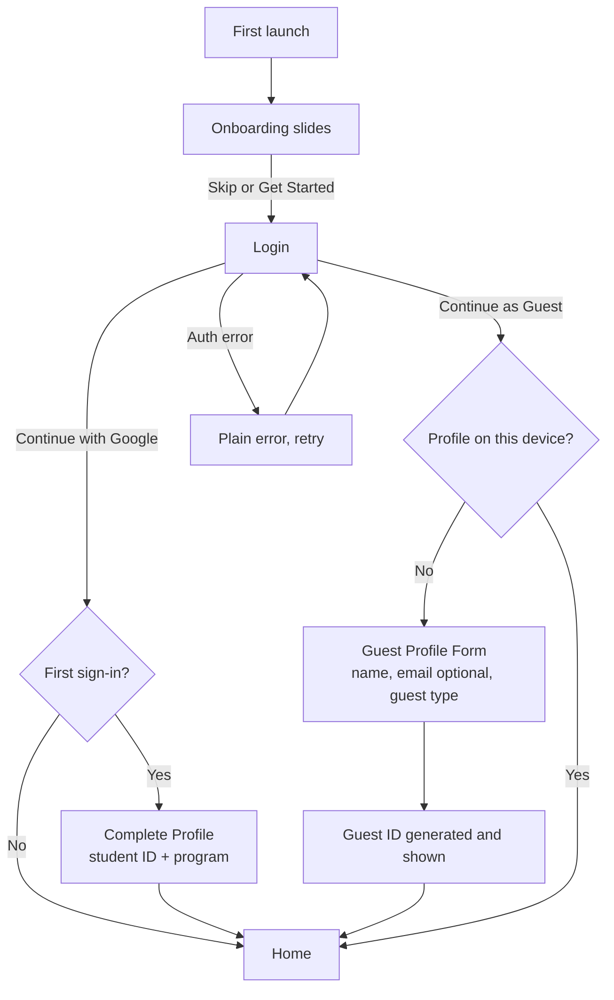
```mermaid
flowchart TD
    A[First launch] --> B[Onboarding slides]
    B -->|Skip or Get Started| C[Login]
    C -->|Continue with Google| D{First sign-in?}
    D -->|Yes| E["Complete Profile<br/>student ID + program"]
    D -->|No| H[Home]
    E --> H
    C -->|Continue as Guest| F{Profile on this device?}
    F -->|No| G["Guest Profile Form<br/>name, email optional, guest type"]
    G --> G2[Guest ID generated and shown]
    G2 --> H
    F -->|Yes| H
    C -->|Auth error| C1[Plain error, retry]
    C1 --> C
```

### 5.2 Home

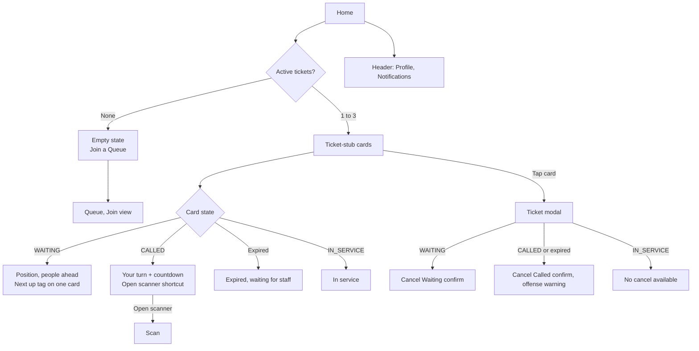
```mermaid
flowchart TD
    A[Home] --> B{Active tickets?}
    B -->|None| C["Empty state<br/>Join a Queue"]
    C --> Q[Queue, Join view]
    B -->|1 to 3| D[Ticket-stub cards]
    D --> E{Card state}
    E -->|WAITING| F["Position, people ahead<br/>Next up tag on one card"]
    E -->|CALLED| G["Your turn + countdown<br/>Open scanner shortcut"]
    E -->|Expired| H["Expired, waiting for staff"]
    E -->|IN_SERVICE| I[In service]
    D -->|Tap card| J[Ticket modal]
    J -->|WAITING| K[Cancel Waiting confirm]
    J -->|CALLED or expired| L[Cancel Called confirm, offense warning]
    J -->|IN_SERVICE| M[No cancel available]
    G -->|Open scanner| S[Scan]
    A --> N[Header: Profile, Notifications]
```

### 5.3 Queue & join

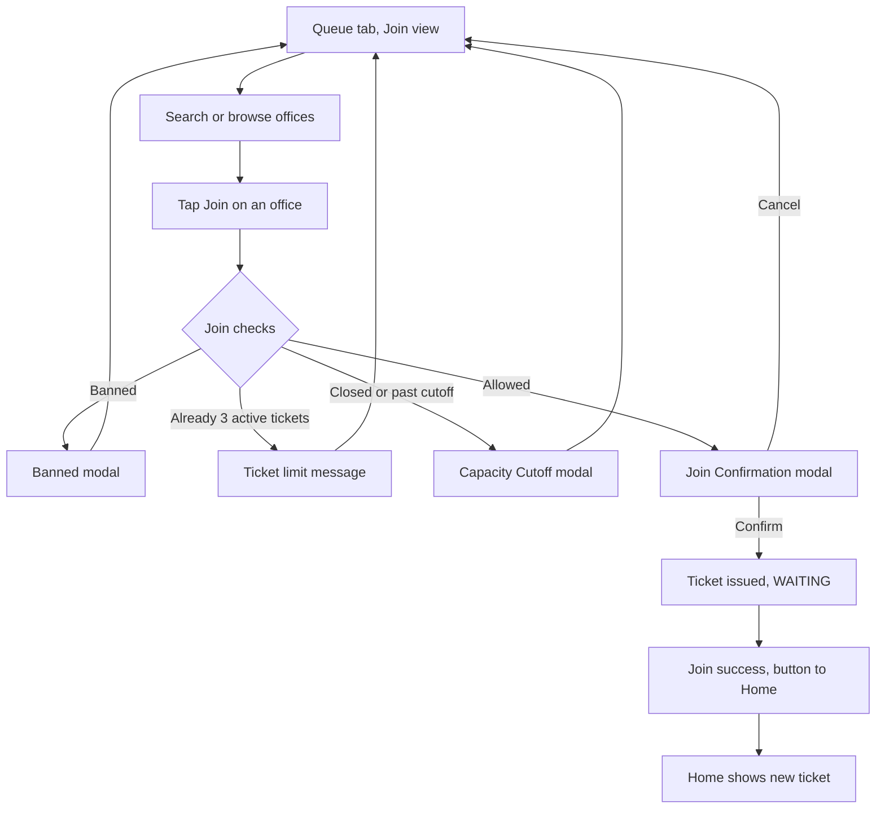
```mermaid
flowchart TD
    A[Queue tab, Join view] --> B[Search or browse offices]
    B --> C[Tap Join on an office]
    C --> D{Join checks}
    D -->|Banned| E[Banned modal]
    D -->|Already 3 active tickets| F[Ticket limit message]
    D -->|Closed or past cutoff| G[Capacity Cutoff modal]
    D -->|Allowed| H[Join Confirmation modal]
    E --> A
    F --> A
    G --> A
    H -->|Cancel| A
    H -->|Confirm| I[Ticket issued, WAITING]
    I --> J[Join success, button to Home]
    J --> K[Home shows new ticket]
```

### 5.4 Called flow & scan

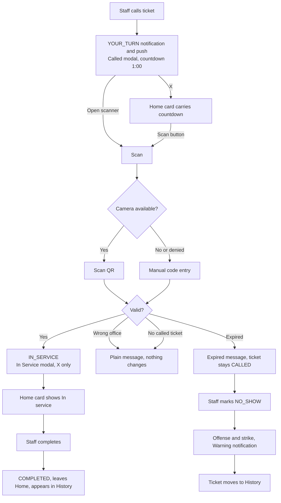
```mermaid
flowchart TD
    A[Staff calls ticket] --> B["YOUR_TURN notification and push<br/>Called modal, countdown 1:00"]
    B -->|X| C[Home card carries countdown]
    B -->|Open scanner| D[Scan]
    C -->|Scan button| D
    D --> E{Camera available?}
    E -->|Yes| F[Scan QR]
    E -->|No or denied| G[Manual code entry]
    F --> H{Valid?}
    G --> H
    H -->|Yes| I["IN_SERVICE<br/>In Service modal, X only"]
    H -->|Wrong office| J[Plain message, nothing changes]
    H -->|No called ticket| J
    H -->|Expired| K["Expired message, ticket stays CALLED"]
    I --> L[Home card shows In service]
    K --> M[Staff marks NO_SHOW]
    M --> N["Offense and strike, Warning notification"]
    N --> O[Ticket moves to History]
    L --> P[Staff completes]
    P --> Q["COMPLETED, leaves Home, appears in History"]
```

### 5.5 History

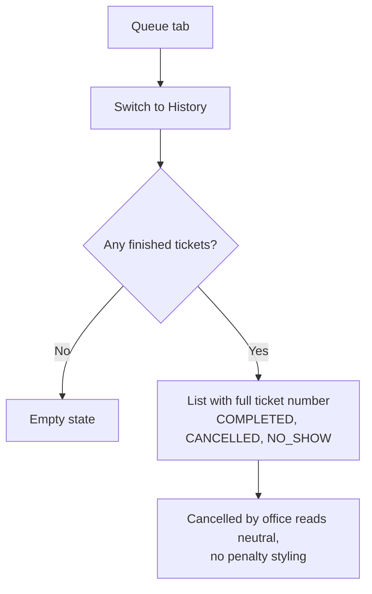
```mermaid
flowchart TD
    A[Queue tab] --> B[Switch to History]
    B --> C{Any finished tickets?}
    C -->|No| D[Empty state]
    C -->|Yes| E["List with full ticket number<br/>COMPLETED, CANCELLED, NO_SHOW"]
    E --> F["Cancelled by office reads neutral,<br/>no penalty styling"]
```

### 5.6 Notifications

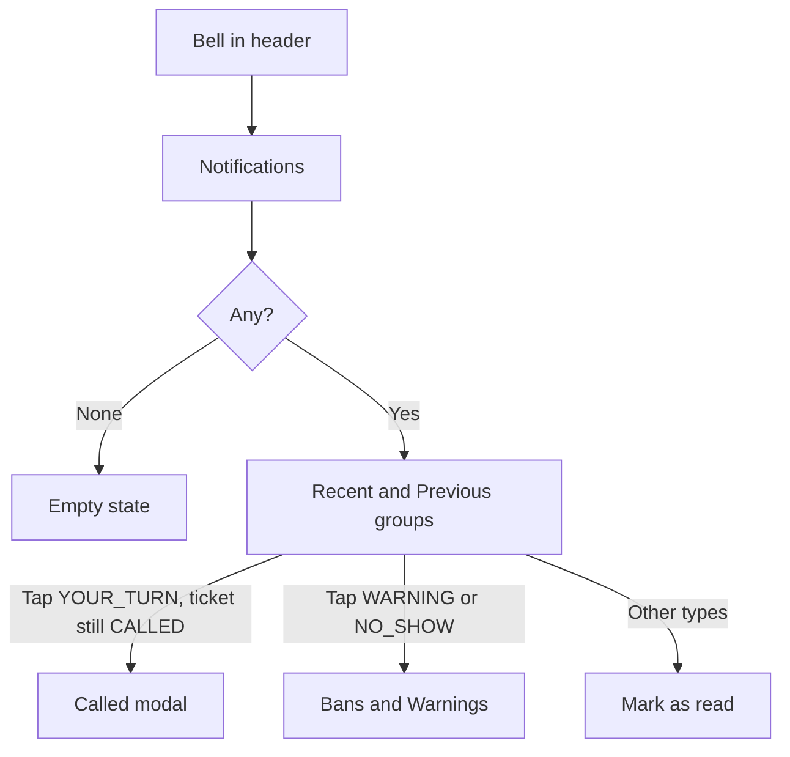
```mermaid
flowchart TD
    A[Bell in header] --> B[Notifications]
    B --> C{Any?}
    C -->|None| D[Empty state]
    C -->|Yes| E[Recent and Previous groups]
    E -->|Tap YOUR_TURN, ticket still CALLED| F[Called modal]
    E -->|Tap WARNING or NO_SHOW| G[Bans and Warnings]
    E -->|Other types| H[Mark as read]
```

### 5.7 Profile

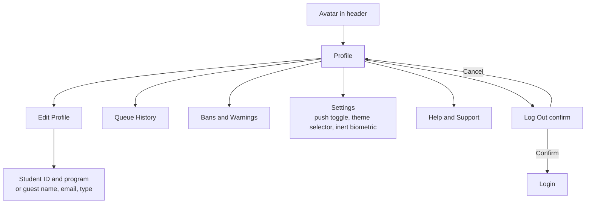
```mermaid
flowchart TD
    A[Avatar in header] --> B[Profile]
    B --> C[Edit Profile]
    C --> C1["Student ID and program<br/>or guest name, email, type"]
    B --> D[Queue History]
    B --> E[Bans and Warnings]
    B --> F["Settings<br/>push toggle, theme selector, inert biometric"]
    B --> G[Help and Support]
    B --> H[Log Out confirm]
    H -->|Confirm| I[Login]
    H -->|Cancel| B
```

### 5.8 Bans & warnings

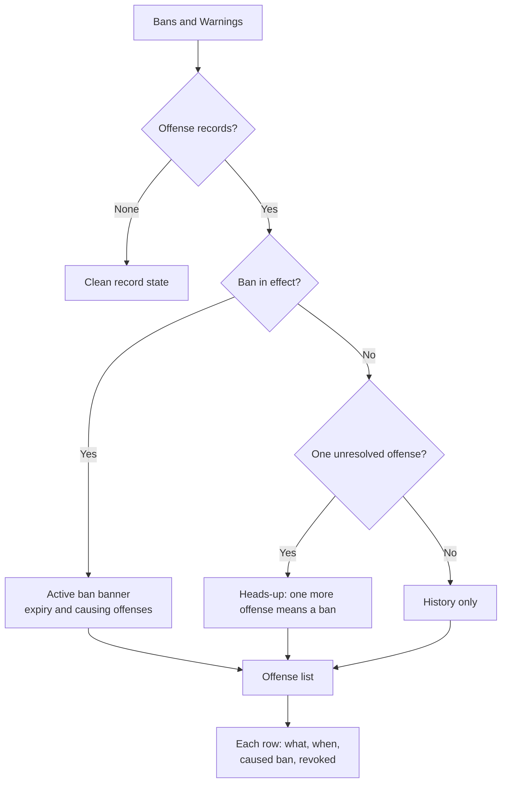
```mermaid
flowchart TD
    A[Bans and Warnings] --> B{Offense records?}
    B -->|None| C[Clean record state]
    B -->|Yes| D{Ban in effect?}
    D -->|Yes| E["Active ban banner<br/>expiry and causing offenses"]
    D -->|No| F{One unresolved offense?}
    F -->|Yes| G["Heads-up: one more offense means a ban"]
    F -->|No| H[History only]
    E --> I[Offense list]
    G --> I
    H --> I
    I --> J["Each row: what, when,<br/>caused ban, revoked"]
```

---

## 6. Staff Screen Specifications

### 6.1 Sign-in (W01)

**Purpose:** institutional entry to the staff app.
**Elements:** QAMPUS mark, **Continue with Google**.
**States:** default; loading; error.
**Exit:** assigned → W03; unassigned → W02.
**Note:** authorization is by office assignment on every request, never by client state (R-27, R-32).

### 6.2 Not Assigned (W02)

Plain message that the account has no office assignment, and who to contact. Sign-out only.

### 6.3 Queue (W03) — main screen

**Purpose:** run the office's queue.

**Layout:** header strip above two columns.

**Header strip**
- Office name, status pill (OPEN / CLOSED), **Open Queue** or **Close Queue**, overflow menu with **Cancel Queue**.
- **Manual code** for this office, shown with a Copy button. This mirrors the display so staff have it if the display tab is closed.
- Joining indicator: "Joining open", or "Joining closed: cutoff reached" with **Override cutoff** (WM07).
- Small readout: queue length and average service minutes.

**Left column — Current ticket panel**
- **Now serving** `CODE-SEQ` (large), holder name, student ID or Guest ID, program or guest type, status badge.
- **Grace countdown** while `CALLED`.
- Actions:

| Action | Enabled when | Notes |
|---|---|---|
| **Call Next** (primary) | No current ticket, or the current ticket is completed / marked | See §15 |
| **Verify by ID** | Current ticket is `CALLED` and not expired | Opens WM02 |
| **Mark No-Show** | Current ticket is `CALLED` and expired | **Always visible, disabled until then**, with tooltip "Available after the 1-minute grace period" |
| **Complete Service** | Current ticket is `IN_SERVICE` | Opens WM04 |

- Empty state: "No ticket in service. Call the next ticket when ready."

**Right column — Waiting list**
- Table in FIFO order: position, `CODE-SEQ`, name, joined time, **Override** (WM01) per row.
- The FIFO candidate is highlighted as "Next".
- Empty state: "No one waiting."

**States**

| State | Treatment |
|---|---|
| Queue CLOSED | Current panel and list read-only; Call Next disabled; Open Queue prominent |
| Expired current ticket | Panel turns Danger-outlined: "Expired. Mark as no-show to continue." Mark No-Show enabled |
| Cutoff approaching | Inline banner (staff notification, R-24) |
| Backend unreachable | Outage state (§8.4) |

**Polling:** shorter interval than mobile (TDD §17). The screen never holds its own copy of queue authority.

### 6.4 Offenses (W04)

**Purpose:** correct mistakes (R-15).
**Elements:** search by student ID or Guest ID; result list — user, full ticket number, type (no-show / cancelled after call), date, caused ban, status (active / revoked); **Revoke** per active row (WM08).
**Scope:** an assigned staff member sees and revokes offenses tied to their own office's tickets.
**States:** default (recent office offenses); search results; empty.

### 6.5 Activity Log (W05)

**Purpose:** accountability for actions affecting others' place in line (R-28).
**Elements:** table — time, **full** ticket number, action, from → to status, actor (name or "System"), reason. Filters: action type, date.
**Actions shown:** joined, called, service started, completed, cancelled, no-show, override, invalid scan, queue cancelled, queue closed, cutoff override, offense recorded, offense revoked.

### 6.6 Staff notifications

Bell in the top bar opens a small panel. Types (R-24): queue approaching cutoff, global announcement. Cutoff also surfaces as an inline banner on W03.

### 6.7 Staff modal specifications

| Modal | Content | Confirm effect |
|---|---|---|
| **WM01 Override** | "Call {CODE-SEQ} ahead of the FIFO candidate? This will be logged." | Calls that ticket; queue is not reordered (R-06) |
| **WM02 Verify by ID** | ID field (student ID or Guest ID). Results: success → `IN_SERVICE`; **no match / wrong ticket** → plain message, nothing changes; **expired** → rejected as expired | Same transition as QR (R-22) |
| **WM03 Mark No-Show** | "Mark {CODE-SEQ} as a no-show? This records an offense for the user." | `NO_SHOW`, offense + strike, user notified. Staff then choose Call Next separately |
| **WM04 Complete** | "Mark {CODE-SEQ} as served?" | `COMPLETED` |
| **WM05 Close Queue** | "Close the queue? No new tickets can be issued. Existing tickets stay valid." | Queue `CLOSED` |
| **WM06 Cancel Queue** | Required reason field. "All tickets will be cancelled and users notified. No one is penalized." | Tickets `CANCELLED`, users notified with reason (R-16) |
| **WM07 Cutoff Override** | "Allow joining past the cutoff? This will be logged." | Joining reopens; logged (R-19) |
| **WM08 Revoke** | Optional reason. "Revoking reverses the strike and lifts any ban it caused." | Offense revoked (R-15) |

---

## 7. Staff Journeys

### 7.1 Sign-in & session guard

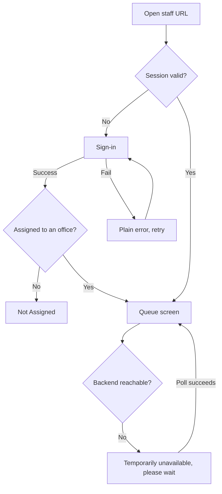
```mermaid
flowchart TD
    A[Open staff URL] --> B{Session valid?}
    B -->|No| C[Sign-in]
    C -->|Success| D{Assigned to an office?}
    C -->|Fail| C1[Plain error, retry]
    C1 --> C
    D -->|No| E[Not Assigned]
    D -->|Yes| F[Queue screen]
    B -->|Yes| F
    F --> G{Backend reachable?}
    G -->|No| H[Temporarily unavailable, please wait]
    H -->|Poll succeeds| F
```

### 7.2 Queue screen — the main loop

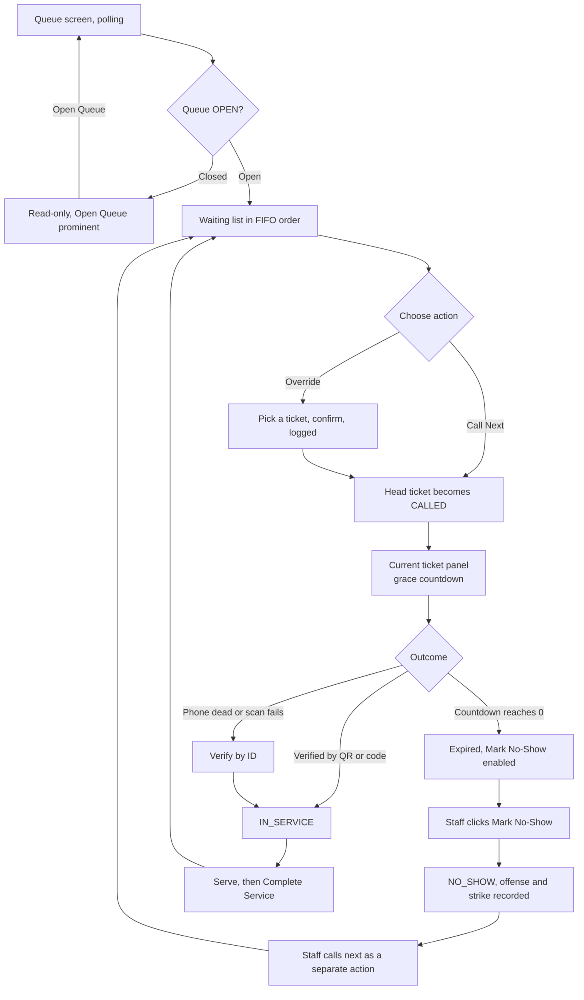
```mermaid
flowchart TD
    A[Queue screen, polling] --> B{Queue OPEN?}
    B -->|Closed| B1[Read-only, Open Queue prominent]
    B1 -->|Open Queue| A
    B -->|Open| C[Waiting list in FIFO order]
    C --> D{Choose action}
    D -->|Call Next| E[Head ticket becomes CALLED]
    D -->|Override| F["Pick a ticket, confirm, logged"]
    F --> E
    E --> G["Current ticket panel<br/>grace countdown"]
    G --> H{Outcome}
    H -->|Verified by QR or code| I[IN_SERVICE]
    H -->|Phone dead or scan fails| J[Verify by ID]
    H -->|Countdown reaches 0| K["Expired, Mark No-Show enabled"]
    J --> I
    K --> L[Staff clicks Mark No-Show]
    L --> M["NO_SHOW, offense and strike recorded"]
    M --> N[Staff calls next as a separate action]
    I --> O[Serve, then Complete Service]
    O --> C
    N --> C
```

### 7.3 Verify by ID

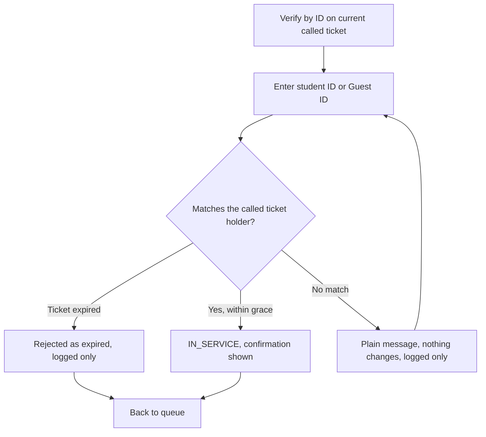
```mermaid
flowchart TD
    A[Verify by ID on current called ticket] --> B[Enter student ID or Guest ID]
    B --> C{Matches the called ticket holder?}
    C -->|Yes, within grace| D[IN_SERVICE, confirmation shown]
    C -->|Ticket expired| E[Rejected as expired, logged only]
    C -->|No match| F[Plain message, nothing changes, logged only]
    E --> G[Back to queue]
    F --> B
    D --> G
```

### 7.4 Mark no-show

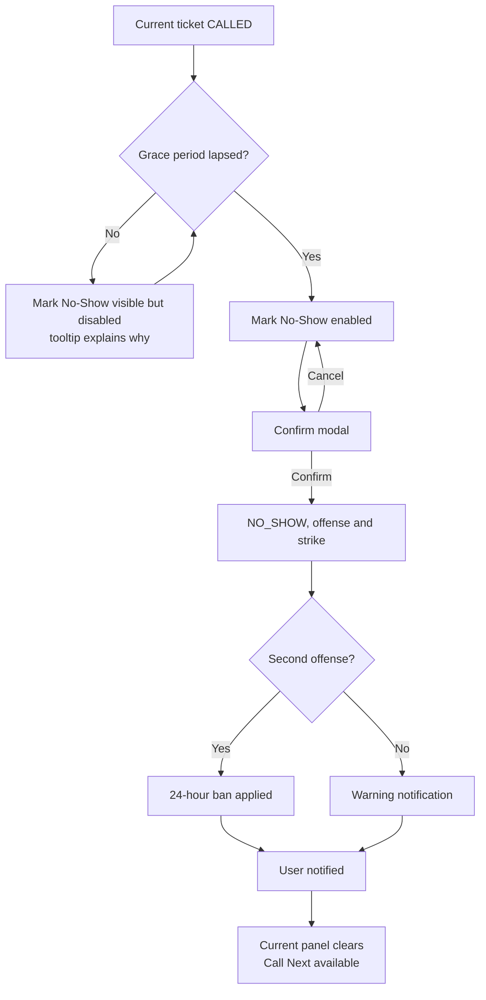
```mermaid
flowchart TD
    A[Current ticket CALLED] --> B{Grace period lapsed?}
    B -->|No| C["Mark No-Show visible but disabled<br/>tooltip explains why"]
    C --> B
    B -->|Yes| D[Mark No-Show enabled]
    D --> E[Confirm modal]
    E -->|Cancel| D
    E -->|Confirm| F["NO_SHOW, offense and strike"]
    F --> G{Second offense?}
    G -->|Yes| H[24-hour ban applied]
    G -->|No| I[Warning notification]
    H --> J[User notified]
    I --> J
    J --> K["Current panel clears<br/>Call Next available"]
```

### 7.5 Close, cancel & cutoff

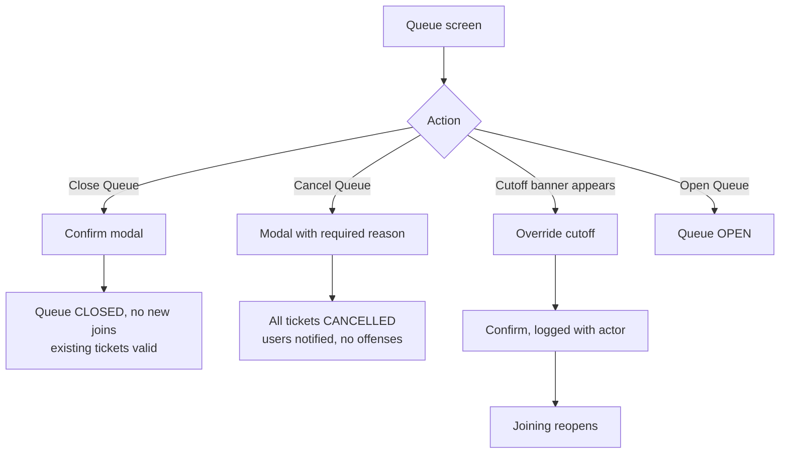
```mermaid
flowchart TD
    A[Queue screen] --> B{Action}
    B -->|Close Queue| C[Confirm modal]
    C --> D["Queue CLOSED, no new joins<br/>existing tickets valid"]
    B -->|Cancel Queue| E[Modal with required reason]
    E --> F["All tickets CANCELLED<br/>users notified, no offenses"]
    B -->|Cutoff banner appears| G[Override cutoff]
    G --> H[Confirm, logged with actor]
    H --> I[Joining reopens]
    B -->|Open Queue| J[Queue OPEN]
```

### 7.6 Offense revocation & activity log

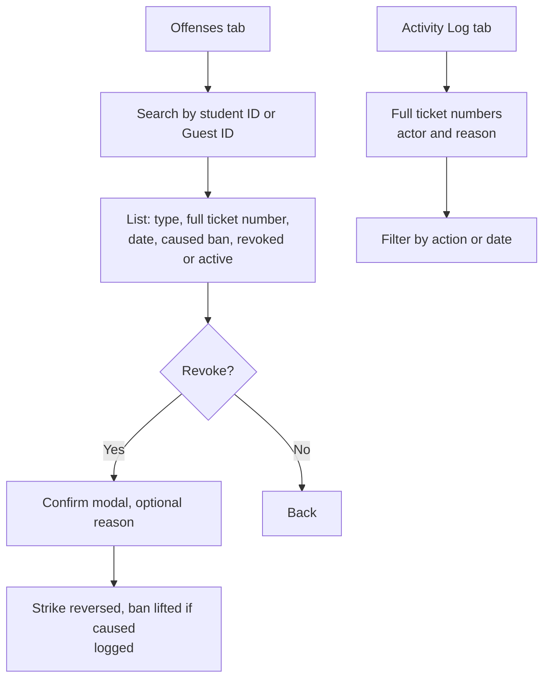
```mermaid
flowchart TD
    A[Offenses tab] --> B[Search by student ID or Guest ID]
    B --> C["List: type, full ticket number,<br/>date, caused ban, revoked or active"]
    C --> D{Revoke?}
    D -->|Yes| E[Confirm modal, optional reason]
    E --> F["Strike reversed, ban lifted if caused<br/>logged"]
    D -->|No| G[Back]
    H[Activity Log tab] --> I["Full ticket numbers<br/>actor and reason"]
    I --> J[Filter by action or date]
```

### 7.7 Staff notifications

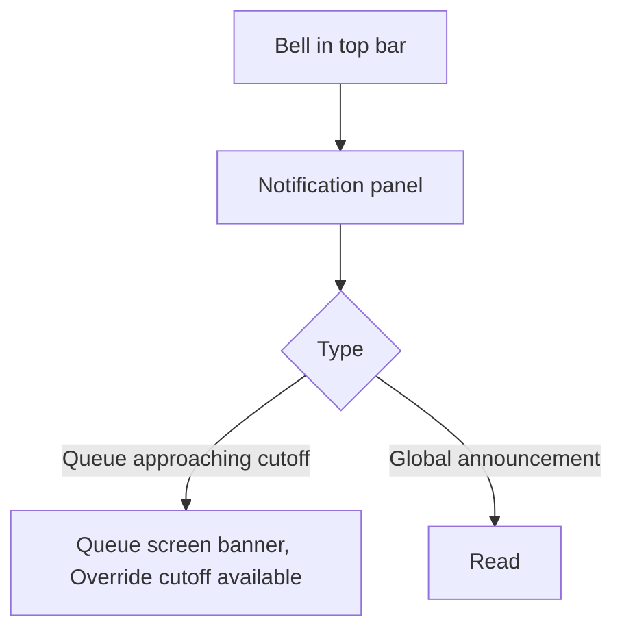
```mermaid
flowchart TD
    A[Bell in top bar] --> B[Notification panel]
    B --> C{Type}
    C -->|Queue approaching cutoff| D[Queue screen banner, Override cutoff available]
    C -->|Global announcement| E[Read]
```

---

## 8. Public Display Specification

**Route:** `/display/:officeCode` · **Auth:** none · **Layout:** 1920 × 1080, no scrolling, no interactive elements.

### 8.1 Content

- **Now Serving** — `CODE-SEQ`, largest element.
- **Next three** — `CODE-SEQ` only. No names or personal data on a public screen.
- **Office QR** — static (rotating QR is future scope).
- **Manual code** — for users whose camera is unavailable.
- Office name.

### 8.2 States

| State | Display |
|---|---|
| Open, ticket called | Now Serving `CODE-SEQ`, next three, QR, manual code |
| Open, nobody called | "Waiting for the next ticket", next three, QR, manual code |
| Open, empty | "No one waiting", QR, manual code |
| Closed | "This queue is closed" and next opening time |

### 8.3 Journey

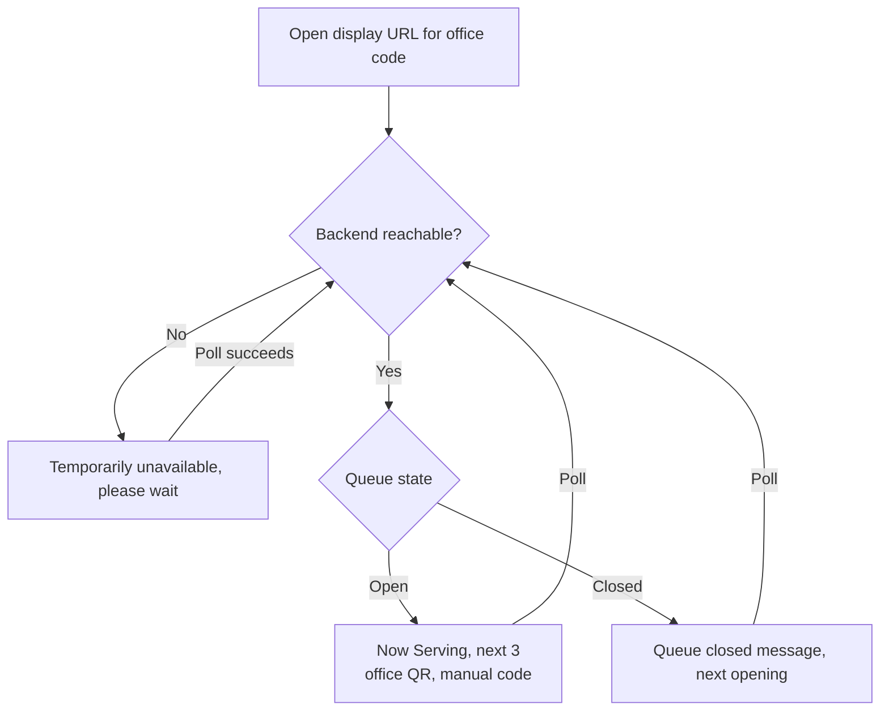
```mermaid
flowchart TD
    A[Open display URL for office code] --> B{Backend reachable?}
    B -->|No| C[Temporarily unavailable, please wait]
    C -->|Poll succeeds| B
    B -->|Yes| D{Queue state}
    D -->|Open| E["Now Serving, next 3<br/>office QR, manual code"]
    D -->|Closed| F[Queue closed message, next opening]
    E -->|Poll| B
    F -->|Poll| B
```

### 8.4 Outage state (all staff surfaces and display)

A plain "Temporarily unavailable, please wait" message in the QAMPUS visual system: Paper background, Ink text, Gold accent, not a generic browser error. No local queue authority, no local persistence, no offline behavior (R-36). It clears automatically when polling succeeds.

---

## 9. Modal & Interaction Patterns

### 9.1 Centered modal

Every confirmation and alert on both mobile and staff web is a centered modal. There are no bottom sheets anywhere. Modal replaces modal; they do not stack (M02 → M03 or M04 replaces M02).

Destructive confirmations put the safe choice ("Keep ticket") in the primary position; the consequential choice is secondary and labelled by its effect.

### 9.2 Segmented switcher

Used once, in Queue: Join (forward-looking) / History (archival).

### 9.3 Disabled actions explain themselves

On staff web, a disabled action shows a tooltip stating when it becomes available (e.g. Mark No-Show). On mobile, a disabled Join shows the explanation inline on the office card.

### 9.4 Polling feedback

Both clients poll (R-33). Cards and panels show a subtle refresh indicator, never a blocking spinner (§10.3).

---

## 10. States & Edge Cases

### 10.1 Empty states

Home with no tickets · History · Notifications · Bans & Warnings (clean record) · Staff waiting list · Staff offenses search with no results.

### 10.2 Error and blocked states

| Situation | Presentation |
|---|---|
| Invalid scan | Plain message (§4.9), no state change |
| Capacity cutoff / queue closed | M08; Join disabled with explanation on the office card |
| Active ban | M07; browsing and history stay available |
| Ticket limit reached | Message naming the three-ticket limit |
| Expired called ticket | "Expired — waiting for staff"; scanner shortcut removed; Cancel still available and still an offense (M04) |
| Queue cancelled by office | Notification with reason; tickets show "Cancelled by office"; no offense |
| Backend unreachable | Mobile: plain unavailable state. Staff and display: §8.4 |
| Camera denied | Manual code entry |

### 10.3 Loading and polling

V1 polls rather than holding a live connection. Ticket cards and staff panels show a small, non-blocking refresh indicator so the interface feels responsive between polls. Countdowns are computed from server timestamps and are presentational only.

### 10.4 Simultaneous calls at two offices (R-09)

Deferred to V2. V1 handles one Called modal at a time; if two arrive, the presentation is unspecified and no special UI is designed.

---

## 11. Accessibility

Targets from PRD R-31:

- Sufficient contrast across Ink / Gold / Paper and the status tokens, for all interactive elements and status text.
- Legible type sizes for one-handed mobile reading; distance legibility on the display.
- **Status is never conveyed by color alone** — every state pairs an icon with a label (§3.4).
- Large touch targets on mobile.
- Plain-language, non-punitive copy for warnings, bans, and errors.
- A non-QR path to verification: manual code (user) and ID number (staff).
- Staff web is fully keyboard-operable: focusable actions, visible focus ring, modals trap focus and close on Escape.

Detailed implementation (specific ratios, screen-reader labels, dynamic type) is addressed during build.

---

## 12. Copy Guidelines

**Tone:** plain, calm, factual. Say what happened and what to do next. Never blame, never use warning-triangle drama for things that are the office's or the system's fault.

| Situation | Copy |
|---|---|
| Called | "It's your turn. Head to {office} and scan the code within 1:00." |
| Expired | "Your time to check in has passed. Staff will update your ticket." |
| Cancel waiting | "Leave this queue? You can join again any time. This won't count against you." |
| Cancel called | "You've already been called. Cancelling now counts as an offense. Two offenses pause your ability to join queues for 24 hours." |
| Warning (first offense) | "This counts as an offense. One more will pause your ability to join queues for 24 hours." |
| Banned | "You can't join a queue until {time}. You can still browse and see your history." |
| Ticket limit | "You can hold up to 3 active tickets. Finish or cancel one to join another." |
| Capacity cutoff | "{Office} can't serve anyone else before it closes at {time}. It opens again {next opening}. Tickets already issued are still valid." |
| Queue closed | "This queue is closed. It opens again {next opening}." |
| Queue cancelled by office | "{Office} cancelled its queue: {reason}. You haven't been penalized." |
| Invalid scan | See §4.9 |
| Outage | "Temporarily unavailable, please wait." |

Ticket numbers in copy follow §3.3.

---

## 13. Requirement Coverage & Design Rationale

### 13.1 Coverage

| Rule | Where in this document |
|---|---|
| R-01 Google sign-in, student ID + program | S04, S05, S14 |
| R-02 Guest profile, generated ID | S04, S06, S14 |
| R-04 / R-05 / R-06 FIFO, staff-controlled, override | W03, WM01 |
| R-07 Three-ticket limit | S07, S09 |
| R-08 / R-08a / R-08b Ticket states, numbers, Home vs History | §3.3, §3.4, S07, S10 |
| R-10 / R-11 Cancel free vs offense | M02, M03, M04 |
| R-12 Grace period, manual no-show | M05, S07, W03, WM03, §7.4 |
| R-13 / R-14 Ban, joining only | M07, S15 |
| R-15 Revocation | W04, WM08 |
| R-16 Office cancellation never penalizes | WM06, S10, §12 |
| R-17 / R-18 / R-19 Capacity and override | M08, S09, W03, WM07 |
| R-20 / R-21 Verification, scan = manual code | S11, M06 |
| R-22 ID-number fallback | WM02, §7.3 |
| R-23 Invalid scans | §4.9, §7.3 |
| R-24 / R-25 Notifications, push for "your turn" | S12, S16, §6.6 |
| R-26 Penalty history from offense records | S15 |
| R-27 / R-28 Authority, actor logging | §2.2, W05 |
| R-31 Accessibility | §11 |
| R-36 Outage state | §8.4 |

### 13.2 Design rationale

| Choice | Justification |
|---|---|
| Three brief, skippable onboarding slides | Users grasp remote joining and turn notifications without a long walkthrough |
| Active tickets above operating hours on Home | Queue status is the most time-sensitive thing a returning user needs |
| Bottom nav with Scan as an emphasized center button | One thumb-reachable tap during in-person check-in, when speed matters most |
| Ticket modal instead of a ticket screen | Cancel was the only remaining function; a modal reuses the existing pattern and keeps Home uncluttered |
| Centered modals everywhere | Consistent, deliberate friction before hard-to-undo actions |
| Join / History as a segmented switcher in Queue | Separates forward and archival content without a second navigation paradigm |
| "Expired" as its own display state | Users see exactly what is true: time is up, staff will act, and the ticket has not yet changed |
| Mark No-Show visible but disabled | Staff learn why it is unavailable instead of wondering where it went, and cannot mark someone early |
| Manual code on the staff Queue screen | Backup when the display tab is closed |
| Names never shown on the public display | It is a public screen; ticket numbers are enough |
| Gold-and-Ink theme with strong contrast | Consistent identity, easy-to-notice interactive elements |

---

## 14. Reconciliation Log

| Figma prototype element | V1 status | Resolution |
|---|---|---|
| Email/password login | Out of scope | Excluded. Google OAuth is the sole institutional sign-in |
| Forgot Password, Change Password screens | Out of scope | Excluded |
| Guest mobile number + OTP | Out of scope (no SMS/OTP) | Replaced by Guest Profile Form and generated Guest ID |
| Biometric login toggle | Inert in V1 | **Kept** in Settings as an inert, navigable toggle |
| Light/dark theme toggle | Functional in V1 | **Kept** in Settings; follows the device by default, user choice overrides it for the session |
| "Repeated Queue Cancellation" warning (WAITING stage) | Not adopted | Excluded; WAITING cancellation is always free |
| Schedule-reminder / appointment-style notifications | Out of scope | Excluded |
| Office windows | Out of scope | Excluded; one queue per office |
| Bans & Warnings copy | Adjust | Aligned to the PRD ban policy (two offenses, 24 hours, joining only); only affected screens change |
| `ARRIVED` status | Superseded | Renamed `IN_SERVICE` |
| "View my Ticket" screen | Dropped | Replaced by the Ticket modal; Cancel lives there |
| Physical terminal (staff mode) | Superseded | Replaced by the staff web application and public display |
| Ticket-stub visual metaphor | Adopted | Hero component for active tickets |
| Gold / Ink / Paper / Slate | Adopted | V1 design tokens (status tokens proposed in addition) |
| Centered modal pattern | Adopted | All confirmations, mobile and staff |
| 3-button bottom nav + header icons | Adopted | Home, Scan (center), Queue; avatar and bell in the header |

---

## 15. Assumptions to Confirm

1. **Call Next guard.** The PRD does not say whether Call Next is allowed while a ticket is still `CALLED` (unexpired) or `IN_SERVICE`. This document disables it in those states to prevent double calls. Confirm this is wanted.
2. **Status color tokens.** Success `#2E7D4F` and Danger `#B3261E` are proposed additions to the Figma palette.
3. **Office hours and location editing.** PRD R-27 gives assigned staff authority to edit location and hours, but the TDD seeds both and builds no editor. No staff screen is specified for it in V1.
4. **Staff sign-in method.** Assumed to be the same institutional Google sign-in as students, gated by office assignment.
5. **Manual code source.** Assumed to be a static per-office code, matching the static QR. Its generation is not yet defined in the PRD or TDD.
6. **Program list source.** Still an open PRD question; S05 and S14 use a placeholder list.
7. **Backend.** Firebase is pending (PRD v1.2). Nothing in this document depends on the backend choice.

---

*End of QAMPUS UI/UX Specification — Version 1.1*
